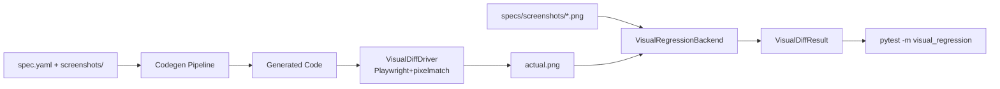

# Requirements

### Overview & Goals

Phase 5c fügt einen **Visual-Regression-Skeleton** zum Conformance-Stack hinzu. Specs referenzieren bereits `screenshots[]` (z.B. `./screenshots/button-primary.png`), aber bisher gibt es weder Referenz-Bilder noch einen Vergleichsmechanismus. Phase 5c liefert die **Infrastruktur** (Backend + Driver-Protocol + Pytest-Marker + minimaler E2E-Test), **nicht** eine vollständige Visual-Regression-Coverage über alle Specs/Targets. Scope-Disziplin analog Phase 5a (Driver-Pfad zuerst, voller Sweep erst Folge-Phase).

### Scope

**In Scope**
- Neues Conformance-Backend `VisualRegressionBackend` + `VisualDiffDriver`-Protocol in `core/src/speccify_core/conformance_visual.py`.
- Mindestens **ein** konkreter Driver (Tooling-Wahl via Stage-0-OQ: `pixelmatch+Playwright` vs. `PIL.ImageChops`).
- Neuer Pytest-Marker `visual_regression` mit Default-Exclude (analog `conformance`).
- Mindestens **ein** E2E-Test mit einer Referenz-PNG (1 Spec × 1 Target) als End-to-End-Proof.
- Verzeichnis-Konvention für Referenz-Bilder dokumentieren (relativ zum Spec, bereits via `screenshots:`-Feld vorgegeben).
- Separater CI-Workflow `.github/workflows/visual-regression.yml` (analog `conformance.yml`) oder Erweiterung von `conformance.yml` (OQ in Stage 0).
- `docs/conformance.md` + ggf. neue `docs/visual-regression.md`.

**Out of Scope**
- Voller Sweep über alle 5 Specs × 3 Targets (Folge-Phase).
- Spec-Schema-Bump (z.B. `screenshots[].tolerance`) — nur falls Stage 0 OQ ergibt, dass tolerance-Feld nötig ist; sonst eigene Phase.
- SwiftUI Visual-Regression (kein Headless-Renderer ohne Xcode-UI-Test-Setup) — nur React/Angular im Skeleton.
- `ng build` AOT-Pipeline (eigener Kandidat, spätere Phase).
- Web-Backend Workspace-aware (eigener Kandidat).

### User Stories

- Als **Spec-Autor:in** will ich Referenz-Screenshots committen können und automatisch bei jeder Codegen-Änderung einen Pixel-Diff bekommen, damit visuelle Regressionen früh auffallen.
- Als **Agent/CI** will ich `visual_regression`-Tests opt-in laufen lassen (Default-Pytest bleibt schnell), damit Tooling-Reibung lokale Entwicklung nicht blockiert.
- Als **Maintainer** will ich Backend-Infrastruktur, die spannungsfrei pro Target erweitert werden kann (Driver-Protocol analog `ToolchainDriver`).

### Functional Requirements

- `VisualRegressionBackend.compare(reference: Path, actual: Path, tolerance: float) -> VisualDiffResult` liefert strukturiertes Ergebnis (`passed`/`pixel_diff_count`/`diff_image_path`).
- `VisualDiffDriver`-Protocol: `available() -> bool`, `render(generated_code: str, target: str) -> Path`, `diff(a: Path, b: Path) -> int`.
- Fehlende Toolchain (z.B. Playwright nicht installiert) führt zu Skip via `toolchain_missing`-Sentinel (analog Phase 5a), **nicht** zu Test-Failure.
- E2E-Test rendert eine Spec, vergleicht gegen committed Referenz-PNG, asserted `passed=True` mit Default-Tolerance (OQ).

### Non-Functional Requirements

- Determinismus: Vergleichs-Output muss reproduzierbar sein (gleiche Toolchain-Version, gleicher Renderer).
- Default-Pytest läuft weiter < 10s; Visual-Tests opt-in via Marker.
- CI-Job darf max. ~3min dauern (Playwright-Browser-Install gecached).


# Technical Design

### Current Implementation

- **Conformance-Stack (Phase 5a)**: `core/src/speccify_core/conformance_build_smoke.py` mit `BuildSmokeBackend` + `ToolchainDriver`-Protocol (`ReactToolchainDriver`, `AngularToolchainDriver`, `SwiftUIToolchainDriver`). Pytest-Marker `conformance` mit Default-Exclude in `pyproject.toml`.
- **CI**: Separater Workflow `.github/workflows/conformance.yml` mit 3 Jobs; Path-Filter + Nightly + Manual-Dispatch.
- **Specs** referenzieren bereits `screenshots: [./screenshots/...]` (siehe `specs/button.speccify.yaml:48-49`, `specs/contact-form.speccify.yaml:57-59` etc.), aber die PNG-Dateien existieren noch nicht im Repo.
- **Sweep (Phase 5b)**: `registry/tests/test_cross_consistency_sweep.py` parametrisiert 75 Pfade — als Vorlage für spätere Visual-Regression-Parametrisierung.

### Key Decisions (zu validieren in Stage 0)

- **D1 — Tooling**: `pixelmatch` (Node-CLI) + Playwright headless für React/Angular *(empfohlen)* vs. reines `Pillow`+`PIL.ImageChops` ohne echtes Browser-Rendering (= nur Diff-Infra-Skeleton). Empfehlung: pixelmatch+Playwright — echtes End-to-End ist mehr wert als nur Diff-Math.
- **D2 — Backend-Layout**: Neues File `conformance_visual.py` parallel zu `conformance_build_smoke.py` (klare Trennung) statt Erweiterung des bestehenden Backends.
- **D3 — Referenz-Bilder im Repo**: Committed unter `specs/screenshots/` (matched bereits die Spec-Pfade). 1 PNG für Skeleton; Volle Coverage in Folge-Phase.
- **D4 — CI-Workflow**: Separater Workflow `visual-regression.yml` (analog 5a) statt Erweiterung von `conformance.yml` — unterschiedliche Toolchain (Playwright vs. tsc/swiftc).
- **D5 — Schema**: **Kein** Schema-Bump in Phase 5c. Default-Tolerance hardcoded im Backend (z.B. `0.1` = 10% Pixel-Diff). Falls Per-Screenshot-Tolerance gewünscht → eigene Schema-Phase.
- **D6 — Targets im Skeleton**: Nur React (SwiftUI raus per Scope, Angular optional). Reduziert Risiko in Skeleton-Phase.

### Proposed Changes

1. **Neues Backend** `core/src/speccify_core/conformance_visual.py`:
   - `VisualDiffResult` (Dataclass: `passed`, `pixel_diff_count`, `total_pixels`, `diff_ratio`, `reason`).
   - `VisualDiffDriver`-Protocol mit `available()`/`render()`/`diff()`.
   - `VisualRegressionBackend.run(spec, target, reference_png) -> VisualDiffResult`.
2. **Konkreter Driver** `PlaywrightPixelmatchDriver` (oder `PilImageChopsDriver` je nach D1):
   - `render()` ruft Playwright headless, lädt generierten React/Angular-Code in einer Mini-HTML-Sandbox, screenshot → `tmp_path/actual.png`.
   - `diff()` shellt `pixelmatch` aus oder nutzt `PIL.ImageChops.difference`.
3. **Pytest-Marker** `visual_regression` in `pyproject.toml` `[tool.pytest.ini_options].markers` + Default-Exclude (`addopts` erweitern).
4. **E2E-Test** `core/tests/test_conformance_visual.py`:
   - 1 parametrisierter Test: `button@0.1.0` × React mit `specs/screenshots/button-primary.png` als Referenz.
   - Toolchain-Missing-Pfad: Test skippt sauber, falls Playwright/Node fehlt.
5. **Referenz-PNG** `specs/screenshots/button-primary.png` committen (mind. 1 Datei als Skeleton-Proof).
6. **CI** `.github/workflows/visual-regression.yml`:
   - Job `visual-regression-react` auf Ubuntu, Node 20, `npx playwright install --with-deps chromium`.
   - Path-Filter (`conformance_visual.py`, `codegen/**`, `specs/screenshots/**`).
   - Nightly-Cron + `workflow_dispatch`.
7. **Docs**: `docs/visual-regression.md` (Konzept + Workflow + How-to für neue Referenz-PNGs) + Link aus `docs/conformance.md` + README-Block.

### Data Models / Contracts

```python
@dataclass(frozen=True)
class VisualDiffResult:
    passed: bool
    pixel_diff_count: int
    total_pixels: int
    diff_ratio: float
    diff_image_path: Path | None
    reason: str | None  # 'toolchain_missing' | 'tolerance_exceeded' | None

class VisualDiffDriver(Protocol):
    target: str  # 'react' | 'angular'
    def available(self) -> bool: ...
    def render(self, generated_code: str, work_dir: Path) -> Path: ...
    def diff(self, expected: Path, actual: Path) -> tuple[int, int]: ...  # (diff_pixels, total)
```

### File Structure

```
core/
  src/speccify_core/
    conformance_visual.py            (NEW)
  tests/
    test_conformance_visual.py       (NEW)
specs/screenshots/
  button-primary.png                 (NEW — committed reference)
docs/
  visual-regression.md               (NEW)
  conformance.md                     (MOD — cross-link + Scope-Tabelle)
pyproject.toml                       (MOD — marker + default exclude)
.github/workflows/
  visual-regression.yml              (NEW)
.agent/plans/
  phase-5c-visual-regression.md      (NEW — dieser Plan)
```

### Architecture Diagram



### Risks

- **Renderer-Nondeterminismus**: Font-Rendering variiert pro OS/Browser-Version — Mitigation: gepinnter Playwright + chromium, Tolerance-Default 10%.
- **Playwright-Install-Größe in CI**: ~200MB Chromium-Download; Mitigation: GitHub-Actions-Cache.
- **Scope-Creep**: Verlockung, gleich alle Specs/Targets abzudecken; Mitigation: Stage-0-OQ klar fixiert: 1 Spec × 1 Target im Skeleton.
- **Referenz-PNG-Pflege**: Ändert sich der Codegen-Output, müssen Refs aktualisiert werden — dokumentieren via `--update-snapshots`-CLI-Flag (Stretch in Stage 0 OQ).


# Delivery Steps

###   Step 1: Stage 0 — Open Questions an User
Plan-Dokument `.agent/plans/phase-5c-visual-regression.md` wird mit Stage-0-Open-Questions an den User übergeben (Phasen-Disziplin analog 3/4/5a/5b).

- Plan-Datei `.agent/plans/phase-5c-visual-regression.md` mit allen Tabs (Requirements/Technical Design) anlegen.
- Open Questions auflisten und auf User-Antwort warten:
  - **OQ1** Tooling: `pixelmatch+Playwright` vs. `PIL.ImageChops`?
  - **OQ2** Targets im Skeleton: nur React, oder React+Angular?
  - **OQ3** Anzahl Referenz-PNGs: nur 1 (button-primary) oder mehrere?
  - **OQ4** Default-Tolerance: 10% (`0.1`) vs. 5% (`0.05`) vs. exakt (`0.0`)?
  - **OQ5** CI-Strategie: neuer Workflow `visual-regression.yml` oder Erweiterung `conformance.yml`?
  - **OQ6** Update-Mechanismus: `--update-snapshots`-Pytest-Flag jetzt oder Folge-Phase?
  - **OQ7** Schema-Bump für `screenshots[].tolerance`: jetzt nötig oder vertagen?
  - **OQ8** Tag-Strategie: `v0.10.0-phase-5c`?
- AGENTS.md + `.agent/resume.md` aktualisieren (Phase 5c gestartet, Plan-Link gesetzt).

###   Step 2: Stage 1 — Backend + Driver-Protocol
`VisualRegressionBackend` + `VisualDiffDriver`-Protocol existieren in `core/` mit Unit-Tests (ohne echte Toolchain).

- `core/src/speccify_core/conformance_visual.py` anlegen mit `VisualDiffResult`-Dataclass + `VisualDiffDriver`-Protocol + `VisualRegressionBackend`-Klasse.
- `toolchain_missing`-Sentinel-Pfad analog `conformance_build_smoke.py` implementieren.
- Pytest-Marker `visual_regression` in `pyproject.toml` registrieren + Default-Exclude (`addopts = -m "not conformance and not visual_regression"`).
- Unit-Tests in `core/tests/test_conformance_visual.py` mit Fake-Driver (kein Netz, kein Browser) für Backend-Logik (passed/failed/toolchain-missing-Pfade).

###   Step 3: Stage 2 — Konkreter Driver (per Stage-0-OQ1)
Mindestens ein konkreter `VisualDiffDriver` (Playwright+pixelmatch oder PIL) rendert React-Code in eine Sandbox und produziert echte PNG-Diffs.

- Je nach OQ1 entweder `PlaywrightPixelmatchDriver` oder `PilImageChopsDriver` in `conformance_visual.py` implementieren.
- Bei Playwright: Mini-HTML-Sandbox-Template, das generierten React-Code via ESM + Babel-Standalone lädt; headless screenshot → `actual.png`.
- `available()`-Check (Node + `playwright`-NPM-Paket vorhanden) bzw. (`PIL` importierbar).
- Manueller Smoke-Run lokal dokumentieren in `docs/visual-regression.md`.

###   Step 4: Stage 3 — E2E-Test + Referenz-PNG
Ein parametrisierter `visual_regression`-Test läuft erfolgreich gegen eine committed Referenz-PNG (`button@0.1.0` × React).

- Referenz-PNG `specs/screenshots/button-primary.png` per manuellem Snapshot erzeugen und committen (User-Action mit AWS-Credentials für Bedrock-Replay-Cache, falls Cache-Recording nötig).
- `core/tests/test_conformance_visual.py` um E2E-Test `test_visual_regression_button_react` erweitern.
- Test rendert Spec via `_render_spec()` (analog Build-Smoke-Helper), ruft Driver, asserted `result.passed == True`.
- Skip-Pfad: falls Driver-`available()==False` → `pytest.skip('toolchain_missing')`.

###   Step 5: Stage 4 — CI-Workflow + Docs + Archivierung
Visual-Regression läuft in CI nightly + on-demand; Doku vollständig; Plan archiviert.

- `.github/workflows/visual-regression.yml` anlegen: Job `visual-regression-react` auf Ubuntu+Node 20, `npx playwright install --with-deps chromium`, Path-Filter, Nightly-Cron, `workflow_dispatch`.
- `docs/visual-regression.md` schreiben: Konzept, Verzeichnis-Konvention, Lokal-Walkthrough, CI-Verhalten, How-to für neue Referenz-PNGs, Update-Workflow.
- `docs/conformance.md` Cross-Link + Scope-Tabelle aktualisieren (Visual-Regression Spalte 5c → `✅`).
- README-Block erweitern (Phase-5c-Erwähnung + Doc-Link).
- Plan archivieren nach `.agent/plans/archive/phase-5c-visual-regression.md`.
- AGENTS.md + `.agent/resume.md` final aktualisieren; Tag-Vorschlag `v0.10.0-phase-5c` an User.