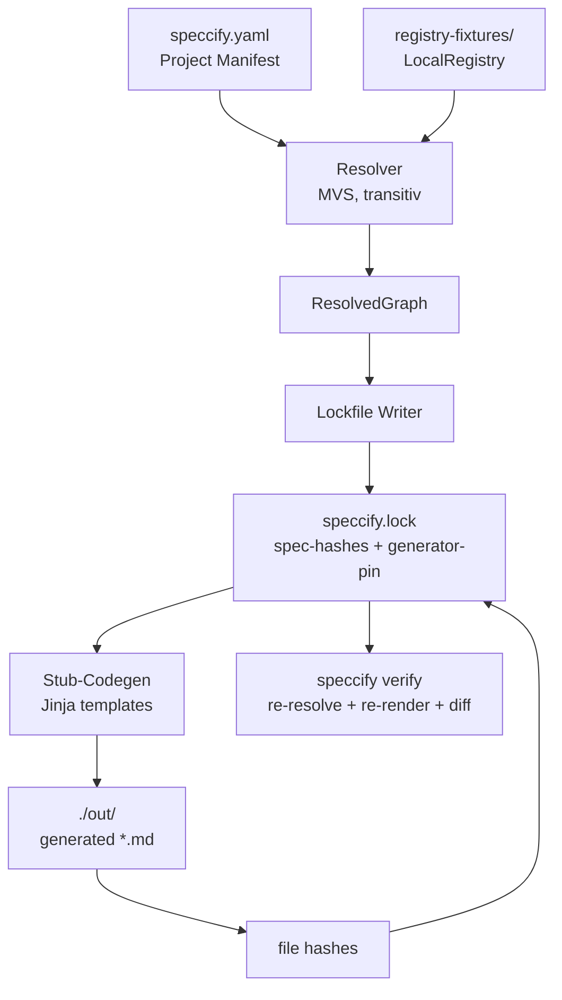

# Requirements

### Overview & Goals

Phase 0 ist abgeschlossen (Schema v0, `speccify lint`, 5 Referenz-Specs, CI grün, Tag `v0.0.0-phase0`). Phase 1a-0 (Rebrand `flowcation` → `speccify`) ist abgeschlossen (Tag `v0.0.1-speccify-rebrand`).

**Ziel von Phase 1a:** Resolver + Lockfile + Stub-Codegen als bewusster Sub-Spike der Phase 1. Ein Toy-Projekt (`example-project/`) kann via
```
speccify add @org/button
speccify pull --target react --out ./out
speccify verify
```
durchlaufen — gegen die fünf Phase-0-Specs aus einem **lokalen Pseudo-Registry-Verzeichnis**. Output ist eine deterministisch generierte Markdown-Datei pro Spec; Lockfile enthält Spec- *und* Output-Hashes plus Generator-Pin (Template-Set).

Die Single Source of Truth ist [`.agent/plans/phase-1a-resolver-lockfile.md`](./.agent/plans/phase-1a-resolver-lockfile.md). Diese Plan-Vorlage spiegelt diesen Phasen-Plan und gibt die operative Stage-Reihenfolge vor.

### Scope

**In Scope**
- Projekt-Manifest `speccify.yaml` (anders als Spec-YAML): `target`, `dependencies`, `registry`-Pfad.
- Lokale Pseudo-Registry: `registry-fixtures/<scope>/<name>/<version>/spec.speccify.yaml` (per `--registry` / `speccify.toml` konfigurierbar).
- Resolver in `speccify_core` mit MVS strikt (Go-Vorbild), transitiv über `uses:`, mit Diamond-Auflösung.
- Lockfile `speccify.lock`: Spec-Bundle-Hashes, `generator{kind: template, template_set, template_version}`, Output-Hashes pro Datei. Eigenes JSON-Schema `schema/lockfile.schema.json`.
- CLI-Befehle `speccify add`, `speccify lock`, `speccify pull --target react`, `speccify verify`.
- Stub-Codegen: deterministischer Markdown-Renderer (`<id>.md`) mit Jinja2-Templates aus `speccify_core.codegen.stub`.
- Pytest für Resolver (Happy-Path, transitiv, Diamond, Konflikt, fehlende Version), Lockfile-Round-Trip, CLI-Smoke.
- CI-Step im Workflow: End-to-End-Lauf gegen `example-project/`.

**Out of Scope**
- SwiftUI- oder echtes React-Codegen-Target (Phase 1b).
- MCP-Server (Phase 1c).
- Browser-Playground (Phase 1d).
- Remote-Registry, sigstore, 2FA, Federation (Phase 2+).
- LLM-basierter Codegen, `model`/`prompt_version`/`seed` im Lockfile (spätere Phase).
- `speccify init`, `speccify publish`/`yank`/`search` (Phase 1b/2).
- Range-Operator `~` und Pre-Releases (in 1a bewusst ausgeklammert).

### User Stories
- *Als Spec-Konsument* will ich `speccify add @org/button` aufrufen, damit `speccify.yaml` und `speccify.lock` automatisch aktualisiert werden — ohne Spec-Inhalte manuell zu kopieren.
- *Als CI-Pipeline* will ich `speccify verify` ausführen, damit ich sicher bin, dass weder die Spec-Bundles noch die generierten Outputs seit dem letzten Commit driften.
- *Als Phase-1b-Implementierer* will ich einen klaren Resolver- und Lockfile-Vertrag, gegen den ich später echtes React- oder SwiftUI-Codegen einsetzen kann.

### Functional Requirements
- `speccify add @scope/name[@<range>]`: Schreibt Eintrag in `speccify.yaml` (Default-Range `^<latest-major.minor>` oder exakt, falls explizit angegeben), löst auf und ruft intern `lock` auf.
- `speccify lock`: Liest Manifest, resolved transitive Dependencies via MVS, schreibt `speccify.lock` mit Spec-Hashes (kein Codegen-Aufruf, Output-Hashes leer).
- `speccify pull --target react --out <dir>`: Liest Lockfile, lädt resolved Specs, ruft Stub-Codegen, schreibt Output, ergänzt Output-Hashes im Lockfile.
- `speccify verify`: Re-resolved, re-generiert in Temp-Verzeichnis, vergleicht *beide* Hash-Sätze; exit 0 nur bei vollständiger Übereinstimmung; bei Drift exit 1 mit Pfad-Liste.
- Diamond-Beispiel muss in Tests vorkommen: `wizard` benutzt `button@^0.1`, `screen` benutzt `button@^0.1.0` → MVS wählt höchste Mindestversion, die beide Constraints erfüllt (`0.1.1`).
- Klare Fehlermeldungen: fehlende Version, inkompatible Ranges, fehlende Spec im Pseudo-Registry, ungültiges Manifest, `pull` ohne vorheriges `lock`.

### Non-Functional Requirements
- **Determinismus**: Identische Manifest+Registry+Template-Set-Inputs → byte-identisches Lockfile und identische Outputs.
- **Offline**: Keine Netzwerk-Calls in Phase 1a (CI-tauglich, offline reproduzierbar).
- **Performance**: Resolver < 50 ms für die fünf Phase-0-Specs (Obergrenze < 500 ms).
- **Stabile Ordnung** im Lockfile (alphabetisch nach `id`, dann SemVer-Tie-Break) für saubere Diffs.
- **Lockfile-Format YAML** (nicht JSON) für Konsistenz zum Spec-Format (Master-Plan, Zeile 211).


# Technical Design

### Current Implementation
- `core/src/speccify_core/loader.py` (PyYAML) — wird in 1a um Manifest- und Lockfile-Loader erweitert (separate Module, `loader.py` selbst bleibt unverändert).
- `core/src/speccify_core/validator.py` (Draft-2020-12, jsonschema) — wird wiederverwendet für Manifest- und Lockfile-Schema.
- `core/src/speccify_core/__init__.py` re-exportiert öffentliche API; wird um neue Symbole erweitert.
- `cli/src/speccify_cli/__main__.py` — Typer-App mit `lint`. Wird um `add`/`lock`/`pull`/`verify` erweitert; bestehende `lint`-Logik bleibt erhalten und wird minimal angepasst (Manifest-Erkennung, siehe Risiken).
- `schema/spec.schema.json` — bleibt unverändert; daneben kommen `schema/manifest.schema.json` und `schema/lockfile.schema.json`.
- `specs/*.speccify.yaml` (5 Stück) — werden nach `registry-fixtures/<scope>/<name>/<version>/spec.speccify.yaml` gespiegelt mit auf `@org/<name>` umgeschriebenen IDs (das Schema erlaubt beide Formen, `spec://` und `@scope/name`).
- Phase-0-Plan unter `.agent/plans/archive/` — bereits abgelegt.

### Key Decisions
1. **React statt SwiftUI als erstes Codegen-Target.** Bewusste Master-Plan-Abweichung. Begründung: Phase 1d (Browser-Playground) ist mit React-Output sofort live demonstrierbar; SwiftUI braucht Xcode/macOS in CI. Master-Plan-Sync in Step 5.
2. **Deterministische Templates statt LLM in Phase 1a.** Master-Plan-Abweichung. Phase 1a verwendet Jinja2-Templates mit `template_set`/`template_version` als Generator-Pin. LLM-Codegen ist eine spätere Phase. Begründung: testbar, reproduzierbar, kein API-Key in CI, klarer Vertrag für Resolver+Lockfile *bevor* der LLM-Layer dazukommt.
3. **Lokales Pseudo-Registry.** Verzeichnis-Layout `registry-fixtures/<scope>/<name>/<version>/spec.speccify.yaml`. Pfad konfigurierbar via `speccify.toml` Key `registry.path`, überschreibbar via `--registry` Flag. Kein Netzwerk in Phase 1a.
4. **MVS strikt nach Go-Vorbild.** Range-Suffixe in 1a: nur `^X.Y` (oder `^X.Y.Z`) und exakte Versionen. `~` und Pre-Releases bleiben ausgeklammert, um Range-Logik klein zu halten. Diamond-Test ist Pflicht-Akzeptanzkriterium.
5. **Stub-Codegen ≠ React-Codegen.** Output ist Markdown (`<id>.md`), nicht `.tsx`. So bleibt klar, dass Phase 1a den *Resolver-/Lockfile-Vertrag* validiert; Phase 1b setzt darauf den echten React-Codegen auf.
6. **Hash-Quelle für Specs**: Bytes der Original-Datei (nicht re-serialisiert) → stabile Hashes unabhängig vom YAML-Dump-Verhalten.

### Proposed Changes

#### 1. Manifest und Pseudo-Registry
Neues Modul `speccify_core.manifest`:
```python
@dataclass(frozen=True)
class ProjectManifest:
    target: str
    dependencies: dict[str, str]  # id → version-range
    registry_path: Path

    @classmethod
    def load(cls, path: Path) -> "ProjectManifest": ...
    def write(self, path: Path) -> None: ...  # stable key order
```
Neues Modul `speccify_core.registry`:
```python
class LocalRegistry:
    def __init__(self, root: Path): ...
    def list_versions(self, spec_id: str) -> list[Version]: ...
    def fetch(self, spec_id: str, version: Version) -> Spec: ...
```

#### 2. Resolver
Neues Modul `speccify_core.resolver`:
```python
@dataclass(frozen=True)
class Resolution:
    spec_id: str
    version: Version
    spec_sha256: str
    via: str  # "registry-fixtures"

@dataclass(frozen=True)
class ResolvedGraph:
    target: str
    resolutions: list[Resolution]  # alphabetisch sortiert

class Resolver:
    def __init__(self, registry: LocalRegistry): ...
    def resolve(self, manifest: ProjectManifest) -> ResolvedGraph: ...
```
MVS-Algorithmus: für jede Dependency die *kleinste* Version sammeln, die allen Constraints genügt; bei Diamond mit unterschiedlichen Mindestversionen das Maximum der Mindestversionen wählen. `ResolverError`-Hierarchie für Konflikte/fehlende Versionen.

#### 3. Lockfile
Neues Modul `speccify_core.lockfile`:
```python
@dataclass(frozen=True)
class GeneratorPin:
    kind: Literal["template"]
    template_set: str
    template_version: str

@dataclass(frozen=True)
class GeneratedFile:
    path: str
    sha256: str

@dataclass(frozen=True)
class LockEntry:
    id: str
    version: str
    sha256: str
    resolved_via: str
    target: str
    generator: GeneratorPin
    generated_files_sha256: list[GeneratedFile]

class Lockfile:
    schema_version: int = 1
    entries: list[LockEntry]
    @classmethod
    def load(cls, path: Path) -> "Lockfile": ...
    def write(self, path: Path) -> None: ...  # deterministischer YAML-Dump
```
Validierung gegen `schema/lockfile.schema.json`.

#### 4. Stub-Codegen
Neues Modul `speccify_core.codegen.stub`:
```python
TEMPLATE_SET = "phase-1a-stub"
TEMPLATE_VERSION = "0.1.0"

def render(spec: Spec, target: str) -> dict[str, bytes]:
    """Returns {relative_path: file_bytes}. Deterministisch, framework-agnostisch."""
```
Template ist Jinja2 (`templates/stub.md.j2`); Output: `<id-as-path>.md` mit `# <title>`, `inputs`/`outputs`/`events`/`acceptance` als Tabellen. `target` landet im Frontmatter — echtes React-Mapping kommt in 1b.

#### 5. CLI-Erweiterungen
`cli/src/speccify_cli/__main__.py` bekommt vier neue Sub-Commands über je ein eigenes Modul `commands/<name>.py`:
- `add(spec_id: str, version: Optional[str], registry: Optional[Path])`
- `lock(registry: Optional[Path])`
- `pull(target: str, out: Path, registry: Optional[Path])`
- `verify(registry: Optional[Path])`

Alle teilen einen `WorkspaceContext`, der Manifest, Lockfile und Registry lädt.

### Data Models / Contracts
```yaml
# speccify.yaml (Project Manifest)
schema_version: 1
target: react
registry:
  path: ./registry-fixtures
dependencies:
  "@org/button": "^0.1"
  "@org/contact-form": "^0.1"
```
```yaml
# speccify.lock
schema_version: 1
specs:
  - id: "@org/button"
    version: 0.1.0
    sha256: "sha256:abcd..."
    resolved_via: "registry-fixtures"
    target: react
    generator:
      kind: template
      template_set: phase-1a-stub
      template_version: 0.1.0
    generated_files_sha256:
      - path: out/org/button.md
        sha256: "sha256:1234..."
```

### Components
- **`speccify_core.manifest`** — neu; reine Datei-I/O + Schema-Validation für `speccify.yaml`.
- **`speccify_core.registry`** — neu; abstrakte Basis + konkretes `LocalRegistry`.
- **`speccify_core.resolver`** — neu; MVS-Implementierung mit `ResolverError`-Hierarchie.
- **`speccify_core.lockfile`** — neu; Lockfile-Read/Write mit Schema-Validation.
- **`speccify_core.codegen.stub`** — neu; Stub-Codegen-Modul; Template-Set statisch versioniert.
- **`speccify_cli.commands`** — neu; dünne Adapter über die `core`-Module. `lint` bleibt funktional, wird nur um Manifest-Erkennung erweitert.
- **`schema/manifest.schema.json`** + **`schema/lockfile.schema.json`** — neu.
- **`registry-fixtures/`** — neu; gespiegelte Phase-0-Specs als `0.1.0` plus `button@0.1.1` für Diamond-Test.
- **`example-project/`** — neu; minimales `speccify.yaml` für End-to-End-Smoke in CI.

### File Structure
```
core/src/speccify_core/
  manifest.py            # neu
  registry.py            # neu
  resolver.py            # neu
  lockfile.py            # neu
  codegen/
    __init__.py          # neu
    stub.py              # neu
    templates/
      stub.md.j2         # neu
  __init__.py            # erweitert: re-exports
  loader.py              # unverändert
  validator.py           # unverändert
cli/src/speccify_cli/
  __main__.py            # erweitert: registriert add/lock/pull/verify
  commands/
    __init__.py          # neu
    add.py | lock.py | pull.py | verify.py   # neu
schema/
  spec.schema.json       # unverändert
  manifest.schema.json   # neu
  lockfile.schema.json   # neu
registry-fixtures/       # neu
  org/button/0.1.0/spec.speccify.yaml
  org/button/0.1.1/spec.speccify.yaml
  org/contact-form/0.1.0/spec.speccify.yaml
  org/http-api-client/0.1.0/spec.speccify.yaml
  org/onboarding-wizard/0.1.0/spec.speccify.yaml
  org/login-screen/0.1.0/spec.speccify.yaml
example-project/         # neu
  speccify.yaml
```

### Architecture Diagram


### Risks
- **MVS-Kantenfälle**: Pre-Releases (`0.1.0-rc.1`) und volle `^0.x.y`-Semantik. Mitigation: in 1a auf `^X.Y` und exakt einschränken; Pre-Releases werden ignoriert (mit Warnung).
- **Hash-Stabilität**: YAML-Dump-Reihenfolge kann Hashes drehen. Mitigation: Specs werden als Bytes der Original-Datei gehasht (nicht re-serialisiert); Lockfile selbst nutzt deterministischen YAML-Dump (sortierte Keys, fixe Quote-Style).
- **Master-Plan-Abweichung**: React-first und Template-Codegen sind sichtbare Abweichungen. Mitigation: Step 5 synchronisiert den Master-Plan inkl. Begründung.
- **`speccify lint` ↔ `speccify.yaml`**: Bestehender `lint` würde das neue Manifest fälschlicherweise gegen das Spec-Schema validieren. Mitigation: `lint` wertet `*.speccify.yaml`-Suffix oder `kind`-Präsenz aus und überspringt Manifeste — kleinster Patch in 1a.
- **Spec-ID-Form**: Existierende Specs nutzen `spec://<name>`; das Pseudo-Registry erfordert `@org/<name>`. Mitigation: Beim Spiegeln nach `registry-fixtures/` werden `id`/`uses`-Felder auf `@org/<name>` umgeschrieben (Schema erlaubt beide Formen).


# Testing

### Validation Approach
Klassischer pytest-Ansatz analog Phase 0: Unit-Tests pro `core`-Modul, CLI-Smoke-Tests via Typer-Runner, plus ein End-to-End-Lauf in `example-project/`. Keine Netzwerk-Tests, keine externen Dienste.

### Key Scenarios
- **Manifest-Round-Trip**: Lade `speccify.yaml`, schreibe es zurück, Bytes sind identisch.
- **Registry-Lookup**: `LocalRegistry.fetch("@org/button", Version("0.1.0"))` liefert die richtige Spec; `list_versions` ist sortiert.
- **Resolver Happy-Path**: Manifest mit zwei direkten Deps, eine davon hat `uses:` → erwartete drei Resolutions.
- **Resolver Diamond**: `onboarding-wizard` braucht `button@^0.1`, `login-screen` braucht `button@^0.1.0` → MVS wählt `0.1.1` (Maximum der Mindestversionen, das beide erfüllt).
- **`speccify add @org/button` E2E**: leeres Manifest + Pseudo-Registry → `speccify.yaml` enthält `"@org/button": "^0.1"`, Lockfile hat einen Eintrag mit korrektem Hash.
- **`speccify pull --target react --out ./out` E2E**: Output-Datei `out/org/button.md` existiert und enthält Title + Acceptance; Lockfile hat `generated_files_sha256` mit passendem Hash.
- **`speccify verify` Happy-Path**: Nach `pull` läuft `verify` mit exit 0.
- **`speccify verify` Drift-Detection**: Manuell veränderte Output-Datei → exit 1 mit klarem Diff-Hinweis.

### Edge Cases
- Fehlende Version im Pseudo-Registry → `ResolverError` mit Hinweis auf verfügbare Versionen.
- Inkompatibler Range (`^0.1` vs `^0.2`) → `ResolverError` listet beide Constraints und Quellen.
- Manifest mit Schreibfehler im Spec-Id-Pattern → Schema-Validierungsfehler beim Manifest-Load.
- Pre-Release-Version im Registry → wird ignoriert mit Warning, MVS nutzt nur Release-Versionen.
- `pull` ohne `lock` → CLI-Fehler „run `speccify lock` first“.
- `verify` mit veraltetem `template_version` → exit 1, Hinweis auf nötigen `speccify pull`.

### Test Changes
- Neu: `core/tests/test_manifest.py`, `test_registry.py`, `test_resolver.py` (inkl. Diamond + Konflikt), `test_lockfile.py`, `test_codegen_stub.py`.
- Neu: `cli/tests/test_add.py`, `test_lock.py`, `test_pull.py`, `test_verify.py`. Bestehender `test_lint.py` bleibt grün.
- CI (`.github/workflows/ci.yml`): zusätzlicher Step `cd example-project && uv run speccify lock && uv run speccify pull --target react --out ./out && uv run speccify verify`.


# Master Plan Updates

Phase 1a weicht in zwei sichtbaren Punkten vom Master-Plan ab. Step 5 synchronisiert das, sonst verlieren spätere Phasen den Bezug.

### Änderungen in `.agent/plans/speccify-plan.md`
1. **Erstes Codegen-Target: React statt SwiftUI** (Master-Plan, Zeile 285).
   - Begründung: Phase-1d-Browser-Playground wird mit React-Output direkt live; SwiftUI bleibt zweites Target in Phase 3.
   - Phase-3-Sektion (Zeile 297) entsprechend umsortieren: SwiftUI + Angular (oder Jetpack Compose).
2. **Generator-Pin: Templates zuerst, LLM später** (Master-Plan, Zeilen 215–222 und 287).
   - Lockfile-Beispiel um Variante `kind: template` (mit `template_set`/`template_version`) ergänzen.
   - LLM-Variante (`model`/`prompt_version`/`seed`) bleibt als spätere Option dokumentiert.
   - Begründung: deterministische Templates sind in CI ohne API-Keys reproduzierbar; LLM-Layer kommt, wenn der Resolver/Lockfile-Vertrag stabil ist.
3. **Phase-1-Aufteilung in Sub-Spikes** (Master-Plan, Zeilen 282–288).
   - Ergänzen: Phase 1 = 1a (dieses Dokument: Resolver/Lockfile/Stub-Codegen) + 1b (echtes React-Codegen + `speccify init`) + 1c (MCP-Server) + 1d (Browser-Playground).

### Status-Sync
- `.agent/status.md`: nach Step 5 auf *Phase 1a abgeschlossen* setzen, nächster Schritt = Phase 1b.
- `AGENTS.md` Sektion „Aktuelle Phase“: nach Abschluss auf Phase 1b verweisen.
- Optionaler annotated Tag `v0.1.0-phase-1a` als Marker nach Step 5.


# Delivery Steps

###   Step 1: Step 1: Manifest und Pseudo-Registry-Layer
`speccify.yaml`-Projektmanifest und das lokale Pseudo-Registry können geladen, validiert und durchsucht werden.

- `schema/manifest.schema.json` neu anlegen mit Feldern `schema_version`, `target`, `dependencies`, optional `registry.path` (Draft 2020-12, analog zu `spec.schema.json`).
- `speccify_core.manifest.ProjectManifest` als immutable `@dataclass(frozen=True)` mit `load(path)`/`write(path)` und deterministischer Key-Reihenfolge.
- `speccify_core.registry.LocalRegistry` mit `list_versions(spec_id)` (sortiert) und `fetch(spec_id, version)` gegen Layout `registry-fixtures/<scope>/<name>/<version>/spec.speccify.yaml`.
- `registry-fixtures/` mit den fünf Phase-0-Specs als `0.1.0` befüllen (IDs/`uses` von `spec://...` auf `@org/...` umschreiben) plus zusätzlicher `org/button/0.1.1/` für den späteren Diamond-Test.
- `example-project/speccify.yaml` als Minimal-Manifest für End-to-End-Smoke (zwei Deps: `@org/button`, `@org/onboarding-wizard`).
- Re-Exports in `core/src/speccify_core/__init__.py` ergänzen.
- Tests `core/tests/test_manifest.py` (Round-Trip, Schema-Fehler, fehlendes Pflichtfeld) und `core/tests/test_registry.py` (Lookup-Happy-Path, fehlende Version, Sortierung).

###   Step 2: Step 2: MVS-Resolver mit transitiver Auflösung und Diamond-Test
`Resolver.resolve(manifest) -> ResolvedGraph` liefert deterministisch das transitive Auflösungsergebnis.

- Neues Modul `speccify_core.resolver` mit `Version`, `Range` (in 1a nur `^X.Y`/`^X.Y.Z` und exakt; `~`/Pre-Releases ausgeklammert), `Resolution`, `ResolvedGraph`, `Resolver`, `ResolverError`-Hierarchie.
- MVS-Algorithmus strikt nach Go-Vorbild: pro Spec-Id Maximum aller geforderten Mindestversionen wählen, das alle Ranges erfüllt.
- Deterministische Sortierung der `resolutions` (alphabetisch nach `id`).
- Spec-Bytes-Hashing: `sha256` der Original-Datei (nicht re-serialisiert) als `Resolution.spec_sha256`.
- Konfliktmeldungen mit Quell-Trace (z. B. `<root> → @org/onboarding-wizard → @org/button`).
- Pre-Releases im Registry werden ignoriert (mit Warnung über `logging.getLogger(__name__).warning`).
- Tests in `core/tests/test_resolver.py`: Happy-Path, transitiver `uses:`-Pfad, Diamond mit `button@^0.1` aus zwei Quellen → erwartet `0.1.1`, Konflikt zwischen unvereinbaren Major-Ranges, fehlende Spec im Registry, fehlende Version, Pre-Release-Ignore.

###   Step 3: Step 3: Lockfile-Format, `speccify lock` und `speccify add`
Lockfile kann gelesen, geschrieben und über die CLI mutiert werden.

- `schema/lockfile.schema.json` mit `schema_version: 1`, `specs[]` inkl. `id`, `version`, `sha256`, `resolved_via`, `target`, `generator{kind: template, template_set, template_version}` und `generated_files_sha256[]`.
- `speccify_core.lockfile` mit `Lockfile.load`/`write` (deterministischer YAML-Dump, sortierte Keys, alphabetisch nach `id`).
- `cli/src/speccify_cli/commands/lock.py`: lädt Manifest, ruft Resolver, schreibt Lockfile *ohne* Codegen-Aufruf (`generated_files_sha256` bleibt leer).
- `cli/src/speccify_cli/commands/add.py`: erwartet `<spec-id>[@<range>]`, fügt Eintrag in `speccify.yaml` ein (Default-Range `^<major.minor>` aus latest-Version im Registry), ruft intern `lock`.
- Beide Commands in `cli/src/speccify_cli/__main__.py` registrieren; `lint` unangetastet.
- Tests: `core/tests/test_lockfile.py` (Round-Trip, Schema-Fehler, sortierte Reihenfolge), `cli/tests/test_lock.py` und `cli/tests/test_add.py` (Smoke gegen `example-project/` + `registry-fixtures/`).

###   Step 4: Step 4: Stub-Codegen und `speccify pull --target react`
`speccify pull` rendert resolved Specs deterministisch nach Markdown und füllt Output-Hashes im Lockfile.

- `speccify_core.codegen.stub` mit Konstanten `TEMPLATE_SET="phase-1a-stub"` und `TEMPLATE_VERSION="0.1.0"` sowie Funktion `render(spec, target) -> dict[str, bytes]`.
- Jinja2-Template `core/src/speccify_core/codegen/templates/stub.md.j2`: Frontmatter (`target`), `# <title>`, Summary, Inputs/Outputs/Events/Acceptance als Markdown-Tabellen.
- `cli/src/speccify_cli/commands/pull.py`: liest Lockfile, fordert resolved Specs aus `LocalRegistry`, ruft Stub-Codegen, schreibt Dateien atomar (via `tempfile`+`os.replace`) nach `--out`, ergänzt `generated_files_sha256` im Lockfile.
- Output-Pfad-Konvention: `<out>/<scope>/<name>.md` (z. B. `out/org/button.md`).
- `pull` ohne vorheriges `lock` → klarer CLI-Fehler.
- `jinja2` als Runtime-Dependency in `core/pyproject.toml` aufnehmen.
- Tests: `core/tests/test_codegen_stub.py` (Determinismus über zwei Aufrufe, korrekte Output-Pfade), `cli/tests/test_pull.py` (E2E gegen `example-project/`, Hash-Update im Lockfile, Pflicht `lock` vorher → klarer Fehler).

###   Step 5: Step 5: `speccify verify`, `lint`-Anpassung, CI-Step und Master-Plan-Sync
Verify schließt den Reproduzierbarkeits-Kreis und Phase 1a wird operativ wie dokumentarisch abgeschlossen.

- `cli/src/speccify_cli/commands/verify.py`: re-resolved Manifest, re-rendered in Temp-Verzeichnis, vergleicht *beide* Hash-Sätze (Spec-Bundle und Output-Dateien); exit 0 nur bei vollständiger Übereinstimmung; bei Drift exit 1 mit Liste betroffener Pfade.
- `cli/src/speccify_cli/__main__.py` `lint`-Logik anpassen: `speccify.yaml` (kein `kind`-Feld) wird übersprungen oder gegen `manifest.schema.json` validiert, statt fälschlich gegen Spec-Schema.
- `.github/workflows/ci.yml` um Schritt erweitern: `cd example-project && uv run speccify lock && uv run speccify pull --target react --out ./out && uv run speccify verify`.
- Tests: `cli/tests/test_verify.py` (Happy-Path, manueller Drift in einer Output-Datei → exit 1, Drift in einer Spec-Bytes → exit 1).
- Master-Plan-Sync (`.agent/plans/speccify-plan.md`): React als erstes Codegen-Target (Zeile 285), Template-Generator-Pin als Variante zum Lockfile-Beispiel (Zeilen 215–222), Phase-1-Sub-Spike-Struktur 1a/1b/1c/1d (Zeilen 282–288).
- `.agent/status.md` und `AGENTS.md` Sektion „Aktuelle Phase“ auf Phase 1b umstellen; Phase-1a-Plan nach `.agent/plans/archive/` verschieben (Status `Done`).
- Optional: annotated Tag `v0.1.0-phase-1a`.