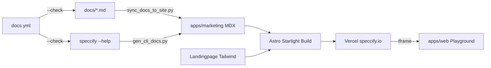

# Overview

### Phase 6 — Landingpage + Doku-Site (`speccify.io`)

**Vorgänger:** Phase 5c (`v0.10.0-phase-5c`). **Ziel-Tag:** `v0.11.0-phase-6` (User setzt selbst).

#### Vision

> Ein Erstbesucher auf `speccify.io` versteht in **< 60 Sekunden**, was Speccify ist, sieht ein laufendes Beispiel (Live-Playground-Embed), kann in die Doku springen und findet eine vollständige Quickstart-Anleitung für CLI, MCP und Browser-Playground.

#### Strategische Begründung

Der technische Kern (CLI + MCP + Registry + Multi-Target-Codegen + Conformance + Visual-Regression-Skeleton) ist belastbar. Der größte ungebaute Hebel ist jetzt **Außenwirkung** — eine öffentliche Landingpage + durchsuchbare Doku-Site. Visual-Regression-Vertiefungen werden in **Phase 7 (optional)** geparkt.

#### Stage-0-Antworten (vom User bestätigt, 2026-06-02)

 # | Frage | Entscheidung |
---|---|---|
 1 | Doku-Stack | **Astro Starlight** |
 2 | Workspace-Layout | **Neuer Member `apps/marketing/`** (Landing + Docs zusammen) |
 3 | Hosting | **Vercel**, Domain `speccify.io` vorhanden |
 4 | Analytics | **Plausible**, EN-only (DE → Phase 8) |
 5 | CLI-Reference | **Skript + CI-Check** (`--check`-Modus, Diff bricht Build) |
 6 | Playground-Demo | **Iframe der Live-Instanz** |
 7 | Design | **Eigener Tailwind-Look für Landing**, Starlight-Default für Docs |
 8 | Legal-Texte | **Platzhalter** in Phase 6, User liefert vor Public-Launch |
 9 | docs/-Beziehung | **Inhalte spiegeln** — Repo-`docs/` bleibt vollwertig, MDX wird daraus generiert |
 10 | i18n | EN-only, DE → Phase 8 |

# Scope

### In-Scope

1. **Workspace-Member `apps/marketing/`** (pnpm + Astro Starlight)
   - Beherbergt Landingpage **und** Doku-Site in einer Astro-Site.
   - Landingpage: eigener Tailwind-Look, Hero, Problem/Lösung, Demo-Snippet, Targets (React/SwiftUI/Angular), „How it works“, CTA, Footer.
   - Doku: Starlight-Default-Theme.

2. **Doku-Navigation**
   - `Getting Started` (Install, erste Spec, erstes `pull`)
   - `Concepts` (Spec-Format, Lockfile, Resolver, Workspaces)
   - `CLI Reference` (autogeneriert)
   - `MCP Reference` (Tool-Liste mit Schemas)
   - `Targets` (React/SwiftUI/Angular)
   - `Conformance` (Build-Smoke + Visual-Regression)
   - `Registry` (Publish/Yank/Auth/Device-Code)
   - `Workspaces`
   - Pagefind-Suche eingebaut.

3. **Content-Spiegelung Repo-`docs/` → Site**
   - `docs/conformance.md`, `docs/visual-regression.md`, `docs/workspaces.md` bleiben vollwertig.
   - Build-Step generiert MDX-Pendants in `apps/marketing/src/content/docs/` (Markdown → MDX-Wrapping mit Frontmatter).
   - CI verifiziert Sync via `--check`.

4. **CLI-Reference Autogen**
   - `scripts/gen_cli_docs.py` ruft `speccify <cmd> --help` für alle Top-Level-Commands ab.
   - Output → `apps/marketing/src/content/docs/cli/`.
   - CI-Check: `python scripts/gen_cli_docs.py --check` muss diff-frei sein.

5. **Playground-Embed**
   - „Try it“-Seite mit `<iframe>` der Live-Playground-Instanz (`apps/web/frontend/`-Deploy).
   - URL-Konfiguration via Astro-Env (`PUBLIC_PLAYGROUND_URL`).

6. **Analytics**
   - Plausible-Snippet (self-hosted oder Cloud) im Site-Layout, nur Production.

7. **Hosting/Deploy**
   - Vercel-Projekt für `apps/marketing/`, Custom-Domain `speccify.io`.
   - PR-Previews aktiviert.

8. **CI**
   - Neuer Workflow `.github/workflows/docs.yml`: Astro-Build, `lychee` Link-Check, `markdownlint`, `gen_cli_docs.py --check`, docs-Sync-Check.
   - Pfad-Filter: `apps/marketing/**`, `docs/**`, `cli/src/**` (CLI-Änderungen triggern Reference-Regen-Check).

### Out-of-Scope

- **Marketplace** (kommerzielle Specs, Billing, Entitlements) — bleibt Master-Plan „on hold“.
- **Community-Features** (Discussions, Profile) — späterer Plan.
- **i18n / DE-Variante** — Phase 8.
- **SEO-Optimierung** über Default-Meta hinaus — späterer Plan.
- **Finale Legal-Texte** (Imprint/Datenschutz) — User liefert vor Public-Launch, Plan nutzt Platzhalter.
- **Visual-Regression-Vertiefungen** → Phase 7 (optional).

# Technical Design

### Current Implementation

- `apps/web/frontend/` = Next.js-15-Playground (Phase 1d), reine App, keine Marketing-/Doku-Seiten.
- `apps/web/backend/` = FastAPI-Backend für den Playground.
- `docs/` = Markdown-Dateien (`conformance.md`, `visual-regression.md`, `workspaces.md`) — in GitHub direkt lesbar.
- CLI: `cli/src/speccify_cli/` mit Click/Typer-Subcommands, alle haben `--help`.
- Kein Marketing-Asset, keine `speccify.io`-Deploy-Konfig.

### Key Decisions (User-bestätigt)

 Decision | Choice | Rationale |
---|---|---|
 Doku-Stack | Astro Starlight | Minimaler JS-Footprint, MDX, Pagefind-Suche, separater Build vom Playground |
 Layout | Ein Member `apps/marketing/` für Landing + Docs | Sauberer Schnitt vom Playground, ein Astro-Build |
 Hosting | Vercel, `speccify.io` | Domain vorhanden, PR-Previews default |
 Landing-Design | Eigener Tailwind-Look | Marken-Identität für Hero/CTA |
 Doku-Design | Starlight-Default | Pragmatisch, geringe Pflege |
 docs/-Source | Repo-`docs/` bleibt Source, MDX wird daraus generiert | Offline-/GitHub-Lesbarkeit erhalten, kein Drift dank CI-Check |
 CLI-Ref | Autogen + CI `--check` | Drift-Schutz ohne Pre-Commit-Zwang |
 Playground | Live-Iframe | Echte Interaktivität, immer aktuell |
 Analytics | Plausible, prod-only | Privacy-friendly, EU-konform |

### File Structure (neu)

```
apps/marketing/
  package.json
  astro.config.mjs              # Starlight-Integration + Tailwind + Plausible
  tailwind.config.mjs           # nur für Landing-Routen
  src/
    pages/
      index.astro              # Landingpage (eigenes Layout)
      try-it.astro             # Playground-Iframe
    content/
      docs/                     # Starlight-Inhalte (MDX)
        getting-started/
        concepts/
        cli/                    # autogeneriert
        mcp/
        targets/
        conformance.mdx         # gespiegelt aus docs/
        visual-regression.mdx
        workspaces.mdx
        registry.mdx
    components/                 # Landing-Components (Hero, Features, CTA)
    layouts/
      MarketingLayout.astro
    styles/
      landing.css
  public/
    logo.svg
    og-image.png

scripts/
  gen_cli_docs.py               # neu: --check / --write
  sync_docs_to_site.py          # neu: docs/*.md → apps/marketing/.../*.mdx mit Frontmatter

.github/workflows/
  docs.yml                      # neu: build + lint + link-check + drift-checks
```

### Auto-Sync-Skripte (Verträge)

**`scripts/gen_cli_docs.py`**
- `--write` (default): regeneriert `apps/marketing/src/content/docs/cli/*.mdx`.
- `--check`: exit-1 wenn Diff zur Working-Copy.
- Iteriert über `speccify --help` Top-Level-Commands; rendert je Command eine MDX-Seite mit Frontmatter (`title`, `description`).

**`scripts/sync_docs_to_site.py`**
- Quelle: `docs/*.md`.
- Ziel: `apps/marketing/src/content/docs/<name>.mdx`.
- Wraps Markdown in Starlight-Frontmatter, normalisiert relative Links (`./conformance.md` → `/conformance/`).
- `--check` analog.

### Architecture Diagram



### Risks

 Risiko | Mitigation |
---|---|
 Drift zwischen `docs/` und Site | CI-`--check`-Modi für beide Sync-Skripte |
 Stack-Lock-In Starlight | Standard-MDX → Migrations-Pfad offen |
 Vercel/Domain blockt Deploy | Stages 1–5 sind hosting-agnostisch, lokal nutzbar |
 Live-Iframe bricht bei Playground-Downtime | Fallback-Hinweis + Cross-Link-Button |
 Plausible-Snippet leakt in Dev | Prod-Guard in `astro.config.mjs` (Env-basiert) |

# Testing

### Validation Approach

- **Build-Smoke**: `pnpm --filter speccify-marketing build` muss durchlaufen.
- **Drift-Checks** im CI: `gen_cli_docs.py --check` und `sync_docs_to_site.py --check` exit-0.
- **Link-Check**: `lychee` über gesamten Build-Output.
- **Markdown-Lint**: `markdownlint` über MDX/Markdown.
- **Lighthouse-Budget** (manuell für Stage 4): Performance ≥ 90, A11y ≥ 95 auf Landingpage.

### Key Scenarios

- Erstbesuch Landingpage → Hero sichtbar, CTA klickbar, Demo-Snippet gerendert.
- Quickstart aus Doku-Site folgen → `speccify lint` + `speccify pull` funktioniert ohne weiteren Repo-Zugriff.
- CLI-Subcommand neu hinzufügen → CI bricht ohne Regen, `--write` macht Build wieder grün.
- `docs/workspaces.md` editieren → CI bricht ohne Site-Sync, `sync_docs_to_site.py` macht ihn grün.

### Edge Cases

- Playground-Backend offline → Iframe zeigt Fallback (Cross-Link sichtbar).
- Plausible blockiert (uBlock) → Site funktioniert vollständig ohne Analytics.
- Search-Index leer während Build → Pagefind-Default-Verhalten dokumentiert.

# Delivery Steps

###   Step 1: Stage 1 — Workspace-Setup `apps/marketing/` + Astro-Starlight-Skeleton
Neuer pnpm-Workspace-Member `apps/marketing/` existiert und baut lokal eine leere Starlight-Site.

- `apps/marketing/` initialisieren via `npm create astro@latest -- --template starlight` (manuelle Anpassung der Struktur).
- `package.json` mit Name `speccify-marketing`, Tailwind-Integration für Landing-Routen einbauen (`@astrojs/tailwind`).
- `pnpm-workspace.yaml` und Root-`package.json` so anpassen, dass `apps/marketing/` als Member erkannt wird.
- `astro.config.mjs` mit Starlight-Integration, Sidebar-Skeleton für die geplante Navigation (Getting Started, Concepts, CLI, MCP, Targets, Conformance, Registry, Workspaces), Pagefind-Default.
- Plausible-Snippet via Env-Guard (`PUBLIC_PLAUSIBLE_DOMAIN`, nur in Prod aktiv).
- README-Link auf `apps/marketing/` ergänzen.

###   Step 2: Stage 2 — Doku-Sync aus Repo-`docs/`
`scripts/sync_docs_to_site.py` spiegelt Repo-`docs/*.md` als MDX in die Starlight-Site und ist im CI verifiziert.

- Skript schreiben mit `--write` / `--check`-Modi.
- Frontmatter-Generator (title aus erstem H1, description aus erster Paragraph-Zeile).
- Link-Rewriting für relative `./xxx.md`-Referenzen auf Starlight-Pfade (`/xxx/`).
- Initiale MDX-Dateien für `conformance`, `visual-regression`, `workspaces` erzeugen.
- Pytest-Test `tests/test_sync_docs.py` (Roundtrip + `--check` exit-codes).
- Stub-Seiten für `getting-started`, `concepts`, `mcp`, `targets`, `registry` anlegen (handgeschrieben, kein Sync).

###   Step 3: Stage 3 — CLI-Reference Autogen
`scripts/gen_cli_docs.py` regeneriert `apps/marketing/src/content/docs/cli/*.mdx` aus `speccify --help` und ist im CI verifiziert.

- Skript: Top-Level-Commands aus `speccify --help` parsen (oder Typer-Introspektion); je Command MDX mit Frontmatter, Usage-Block, Options-Tabelle.
- `--write` / `--check`-Modi analog Stage 2.
- Index-Seite `cli/index.mdx` mit Übersicht.
- Pytest-Test `tests/test_gen_cli_docs.py` (Snapshot je Command, deterministisch).
- Initialer Lauf, MDX-Dateien committen.

###   Step 4: Stage 4 — Landingpage (Tailwind-Look)
`apps/marketing/src/pages/index.astro` zeigt eine fertige Landingpage mit Hero, Sections und Footer.

- Hero („npm für Spezifikationen statt für Code“) + Sub-Headline + Primär-CTA (Quickstart) + Sekundär-CTA (GitHub).
- Problem/Lösung-Block (3–5 Stichpunkte).
- Demo-Block mit Code-Snippet `speccify pull spec://button@1.0.0 --target react` + Output (statischer Auszug, via Shiki gehighlightet).
- Targets-Block (React/SwiftUI/Angular mit Logos).
- „How it works“ (3 Schritte: Spec → Resolver → Codegen).
- Footer mit MIT, GitHub-Link, Imprint-/Datenschutz-Platzhalter-Seiten.
- Tailwind-Konfiguration auf Landing-Layout beschränken, Starlight-Routen unberührt lassen.
- Lighthouse-Smoke (manuell): Performance ≥ 90, A11y ≥ 95.

###   Step 5: Stage 5 — Playground-Iframe + Cross-Links
`/try-it`-Seite lädt den Live-Playground per Iframe, mit Fallback bei Downtime.

- `src/pages/try-it.astro` mit `<iframe>` auf `PUBLIC_PLAYGROUND_URL`.
- Fallback-Block (sichtbarer Cross-Link + Hinweis) wenn URL leer/Iframe blockiert.
- Header-/Footer-Cross-Links in der gesamten Site: GitHub, Playground, Doku.
- `try-it` in Starlight-Sidebar + Landing-CTA verlinken.

###   Step 6: Stage 6 — CI-Workflow `docs.yml`
Neuer GitHub-Actions-Workflow validiert Build + Sync-Drift + Links bei jedem PR.

- `.github/workflows/docs.yml` mit Pfad-Filter (`apps/marketing/**`, `docs/**`, `cli/src/**`, `scripts/gen_cli_docs.py`, `scripts/sync_docs_to_site.py`).
- Jobs: `pnpm install` → `python scripts/sync_docs_to_site.py --check` → `python scripts/gen_cli_docs.py --check` → `pnpm --filter speccify-marketing build` → `lychee` Link-Check → `markdownlint`.
- Vercel-Projekt-Setup dokumentieren (User führt Account-Schritte aus); Custom-Domain `speccify.io` + PR-Preview-Verhalten in `docs/deploy.md` notieren.
- Default-CI (`ci.yml`) bleibt unberührt.

###   Step 7: Stage 7 — Verifikation, Doku, Archivierung
Phase 6 ist abgeschlossen und archiviert.

- Manueller Smoke: `pnpm --filter speccify-marketing build` grün, alle internen Links auf der gebauten Site auflieren, CLI-Reference matcht aktuelle Binary, Playground-Iframe lädt.
- AGENTS.md „Aktuelle Phase“ auf Phase 6 setzen, Verifikationszahlen ergänzen.
- README mit Doku-Site-Link + Quickstart-Hinweis.
- Plan archivieren nach `.agent/plans/archive/phase-6-landing-and-docs.md`.
- Tag-Vorschlag an User: `v0.11.0-phase-6` (nicht selbst setzen, vgl. `rules.md`).