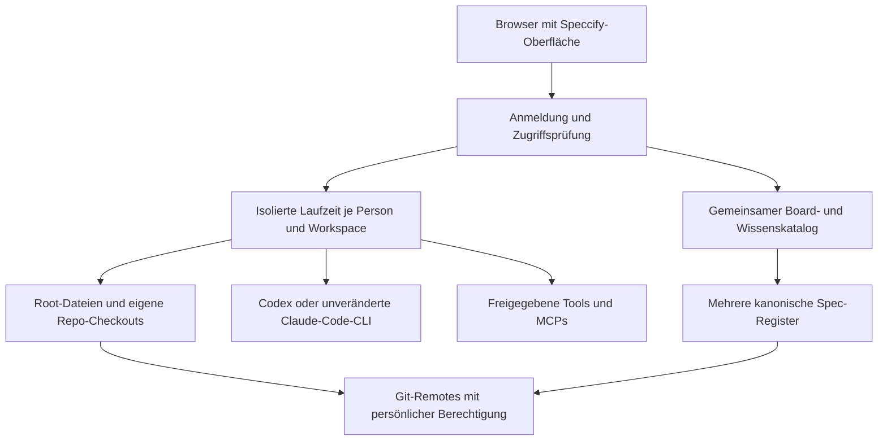

# DRAFT — Speccify als Web-Anwendung

**Recherche: 2026-09-16 · Status: Draft · keine Arbeitsanweisung.**
Dieser Text sammelt Befunde und Vorschläge. Er aktiviert keine Umsetzung,
ändert keine Prioritäten und ersetzt keine bestehenden Playbooks. Die
produktseitige Draft-Unterstützung wird durch Spec 047 bereitgestellt; diese
Recherche bleibt dadurch unverbindlich.

## Ergebnis

**Ja, eine serverbasierte Speccify-Anwendung ist technisch plausibel.**
Dateien, Git, Specs, Skills, Tools, MCPs und Agent-Prozesse können auf einem
Server liegen; ein Browser kann die Bedienung übernehmen. Dafür braucht es
einen Serveradapter mit Benutzer- und Workspace-Isolation. Die Tauri-Oberfläche
allein lässt sich nicht als vollständige Web-Anwendung ausliefern.

Die gewünschte persönliche Anmeldung ist für Codex dokumentiert. Auch eine
unveränderte Claude-Code-CLI in einer gehosteten Umgebung ist unter den unten
genannten Bedingungen vorgesehen. Eine eigene Claude-SDK-Oberfläche mit
Claude-Abonnement-Login ist ein anderer Integrationsweg und nicht pauschal
freigegeben. Es gibt noch keinen Speccify-Prototyp, der diese Wege praktisch belegt.

## Was bereits vorhanden ist

Quellcodebasis `a6a90b1`, lokal geprüft:

| Baustein | Wiederverwendbarer Bestand | Fehlender Serververtrag |
|---|---|---|
| Oberfläche | React-Ansichten, Markdown-Editor, Board, Terminaldarstellung | Tauri-Aufrufe und Ereignisse durch authentifizierte HTTP-/WebSocket-Adapter ersetzen |
| Fachlogik | Python-Core, dünne CLI-/MCP-Adapter | Benutzer-/Workspace-Zuordnung für jede Operation; keine zweite Domänenlogik |
| Web-Board | `apps/board`: mehrere Register, Lesen, Stations-/Task-Änderungen, Git-Sync, MCP | Persönliche Identitäten/Rechte, dieselben Quellen wie Desktop; Root-/Kind-Aggregation korrigieren |
| Dateien/Git | Native Desktop-Verträge und zielgebundene Änderungen | Server-Checkouts, Versionskonflikte, Upload/Download und Rechteprüfung |
| Ausführung | Native PTYs, Host-Start, Aktionen und MCP-Supervisor | Prozessverwaltung über Browserverbindungen hinweg, Isolation, Abbruch und Wiederaufnahme |

Das bestehende Board nutzt ein gemeinsames Web-Passwort und eine gesonderte
MCP-Authentifizierung. Das ist kein persönliches Berechtigungsmodell für einen
vollständigen Entwicklungsserver. Lokale Quellen entdecken außerdem aktuell
entweder das Root-Register oder die direkten Unterprojekt-Register. Diese
Entweder-oder-Regel würde gerade im gewünschten Multi-Projekt-Modell Specs ausblenden.

## Drei getrennte Anmeldungen

1. **Speccify:** Wer darf welchen Workspace öffnen, Dateien sehen und Sitzungen
   bedienen? Vorschlag: Anmeldung über einen vorhandenen OIDC-Anbieter und
   serverseitige Zugriffsprüfung für HTTP, WebSockets und Hintergrundaufträge.
2. **Git:** Unter welcher Identität darf die Person die beteiligten Code- und
   Spec-Register lesen und pushen? Ein Speccify-Login verschafft keine Git-Rechte.
   Für den gewünschten Team-Workspace müssen die erforderlichen Zugriffe auf
   alle beteiligten Repos geprüft werden. Branchschutz bleibt wirksam; voller
   Arbeitszugriff bedeutet nicht automatisch Repository-Administration.
3. **Modellanbieter:** Der jeweilige Benutzer meldet seine persönliche
   Codex-/Claude-Laufzeit an. Ein gemeinsamer Serveraccount darf die getrennten
   Benutzerkonten und Nutzungsbudgets nicht unbemerkt ersetzen.

Dies ist ein Architekturvorschlag. Ein gemeinsamer Git-Serviceaccount wäre eine
abweichende Produktentscheidung und erfüllt allein nicht die geforderte Prüfung
der persönlichen Repo-Rechte. Commit-Autor, ausführende Person und verwendeter
Git-Zugang müssen nachvollziehbar bleiben.

## Codex: Browser-Anmeldung für eine Server-Laufzeit

Die offizielle Dokumentation beschreibt `codex login --device-auth`: Die CLI
läuft entfernt, die Person öffnet einen Link im Browser und bestätigt einen
einmaligen Code. Diese Beta-Funktion muss in den persönlichen Einstellungen
oder durch den Workspace-Admin erlaubt sein. Ein gewöhnlicher Login mit
localhost-Rückruf benötigt auf entfernten Rechnern zusätzliche Weiterleitung;
er ist nicht automatisch ein funktionierender Web-App-Login.
Quelle: [Codex Authentication](https://learn.chatgpt.com/docs/auth).

Der App Server dokumentiert außerdem `account/login/start` mit
`chatgptDeviceCode`, Login-Abschluss/-Abbruch sowie strukturierte
Ausführungsfreigaben. Damit lässt sich eine Browseroberfläche technisch anbinden,
ohne einen Terminalbildschirm auswerten zu müssen. Lokal sind `codex login
--device-auth` und `codex app-server` laut CLI-Hilfe vorhanden; die Hilfe
beweist keinen erfolgreichen Server-Login.
Quelle: [Codex App Server](https://learn.chatgpt.com/docs/app-server).

**Vorschlag:** Für einen Prototyp je Person eine eigene Laufzeit mit getrenntem
Auth-Speicher; den Anbieter-Login vom Speccify-Login trennen. Browsercode erhält
keine dauerhaften Anbieter-Tokens. Provider- und Organisationsbedingungen für
das konkrete Bereitstellungsmodell vor einer Produktfreigabe erneut prüfen.

## Claude: zwei unterschiedliche Wege

### A — Die unveränderte CLI im Browser-Terminal

Anthropics aktuelle Bedingungen beschreiben ausdrücklich das Hosting der
unveränderten Claude-Code-Binary in Produkten oder Diensten. Voraussetzung sind
die Commercial Terms, unveränderte integrierte Anmeldeverfahren und die eigene
Authentifizierung des jeweiligen Endnutzers. Dessen Nutzung wird unter seinem
Anbietervertrag abgerechnet. Die Plattform darf Claude-Nutzung nicht weiterverkaufen
oder Claude.ai-Zugangsdaten selbst einsammeln. Die Bedingungen unterscheiden
diesen Fall ausdrücklich von einer eigenen Anwendung mit Claude.ai-Login.
Quelle: [Claude Code Legal and compliance](https://code.claude.com/docs/en/legal-and-compliance).

Die CLI dokumentiert den Browser-Link und einen manuell in die CLI einzufügenden
Login-Code, falls der lokale Rückruf beispielsweise in SSH oder einem Container
nicht erreichbar ist. **Folgerung:** Ein persönliches Browser-Terminal zur
unveränderten Server-CLI ist ein plausibler Weg für Speccify. Den Login durch
Anthropics Ablauf führen; keine eigene Token-Importmaske bauen. Der genaue
Browser-/Container-Roundtrip ist noch zu erproben.
Quelle: [Claude Code Authentication](https://code.claude.com/docs/en/authentication).

### B — Eigene Chat-Oberfläche mit Agent SDK

Das SDK stellt Werkzeuge, Sitzungen, MCP und Berechtigungsinteraktionen
programmatisch bereit. Die Dokumentation erlaubt Drittprodukten ohne vorherige
Freigabe jedoch keinen eigenen Claude.ai-Login bzw. die Übernahme der
Abonnement-Limits. Dafür ist die dokumentierte API-Key-/Cloud-Provider-Anbindung
der Ausgangspunkt. Diese Route erfüllt daher nicht automatisch den Wunsch,
ein vorhandenes persönliches Claude-Abonnement zu verwenden.
Quelle: [Claude Agent SDK overview](https://code.claude.com/docs/en/agent-sdk/overview).

Das SDK betreibt selbst einen zustandsbehafteten CLI-Unterprozess; Sitzungen,
Arbeitsdateien und Isolation brauchen echte Laufzeit- und Speicherverwaltung.
Ein zustandsloser Web-Endpunkt reicht dafür nicht.
Quelle: [Hosting the Agent SDK](https://code.claude.com/docs/en/agent-sdk/hosting).

## Möglicher Aufbau — noch keine Entscheidung

**Abgeleiteter Entwurf:** Für einen ersten internen Versuch Browser-Terminal und
bestehende Datei-/Board-Bedienung kombinieren. Eine eigene strukturierte Chat-UI
ist eine getrennte Option, kein notwendiger erster Schritt.

- Je Person und Workspace getrennte Arbeitsbäume, Prozesse und Auth-Speicher.
  Zwei Personen dürfen nicht gleichzeitig denselben Git-Index bedienen.
- Gemeinsame Specs bleiben in ihren kanonischen Registern. Stabile Quell-IDs
  verbinden Desktop und Web; derselbe Checkout an zwei Orten erzeugt keine
  zweite Spec. Siehe [Multi-Repo-Register 046](../specs/046-multi-repo-register/SPEC.md).
- Werkzeuge starten mit explizitem Quellpfad, Ziel und Arbeitsverzeichnis.
  Lokale stdio-MCPs können im Benutzer-Container laufen; Verbindungen zu
  internen Diensten benötigen passende Erreichbarkeit und Berechtigungen.
- Browser-Neuladen darf keinen zweiten Auftrag starten. Sitzungs-ID,
  Ausgabepuffer, laufende Freigaben, Abbruch und Wiederverbindung brauchen
  einen gemeinsamen Vertrag. Serverneustart und Browserabbruch sind getrennte Fälle.
- Provider-Login-Eingaben und Tokens nicht in Terminalaufzeichnungen,
  Diagnoseexporte oder zentrale Protokolle übernehmen. Anbieter verwalten ihren
  Auth-Speicher innerhalb der persönlichen Umgebung.
- Geteilte Register benötigen Konflikterkennung und revisionsgebundene
  Schreibaktionen; ein Registerfehler darf andere Quellen nicht verdecken.

## Was nicht automatisch gleichwertig wird

| Bereich | Konsequenz für den Entwurf |
|---|---|
| Lokale Dateien außerhalb Git | Auf dem Server nicht vorhanden; Upload, Workspace-Speicher oder eine ausdrücklich eingerichtete Freigabe nötig, auch für normale Root-Ordner |
| Plattformgebundene Builds | Ein Linux-Server ersetzt keine macOS-/Windows-Werkzeugkette; passende entfernte Runner oder plattformspezifische Server wären zusätzlich nötig |
| Lokale Programme und Geräte | Native Dialoge, Schlüsselbund, Geräte und Desktop-Apps benötigen Ersatz oder einen lokalen Begleiter |
| Offline-Arbeit | Eine reine Server-Web-App ist vom Server und Netz abhängig; der Desktop behält seinen lokalen Nutzen |
| Team-Betrieb | Updates, persistente Volumes, Wiederherstellung, Prozesslimits und gleichzeitige Sitzungen werden Betreiberaufgaben |

Diese Grenzen folgen aus dem vorgeschlagenen Ausführungsort; sie sind keine
bereits getesteten Einschränkungen einer existierenden Speccify-Web-App.

## Denkbarer Machbarkeitsnachweis

Noch nicht beauftragt; absichtlich keine aktive Aufgabenliste:

1. Zwei Testpersonen, zwei Testrepos und ein gewöhnlicher Root-Ordner. Beide
   sehen dasselbe Board; ihre Arbeitsbäume und Sitzungen bleiben getrennt.
2. Persönliche Anmeldung vom Browser aus in eine entfernte Codex-Laufzeit und
   eine unveränderte Claude-Code-CLI. Abbruch, erneute Anmeldung und Logout
   nachvollziehen, ohne Anmeldedaten im Speccify-Protokoll zu speichern.
3. Datei ändern, Test ausführen, Diff prüfen, als angemeldete Person committen
   und unter ihren Git-Rechten pushen. Fehlende Repo-Rechte und Branchschutz
   werden sichtbar; keine fremde Sitzung kann den Auftrag freigeben.
4. Browser schließen und erneut verbinden; dieselbe laufende Sitzung, wartende
   Freigabe und Abbruchmöglichkeit wiederfinden. Serverneustart separat prüfen.
5. Root- und Unterprojekt-Register, gleiche Spec-Nummern, konkurrierende Änderung
   und ein nicht erreichbares Register durchspielen. Desktop und Web zeigen
   dieselbe kanonische Quellmenge mit erkennbarem Synchronisationsstand.

Erst daraus lassen sich eine belastbare Aufwandsschätzung und eine konkrete
Produktentscheidung ableiten. Offene Entscheidungen: interner Teamserver oder
mehrmandantenfähiges Angebot, Zielbetriebssysteme, Identitätsanbieter, persönlicher
Git-Zugang und CLI-Terminal versus strukturierte SDK-Oberfläche.

## Nachweis und Grenzen dieser Recherche

Geprüft wurden die genannten Primärquellen, lokale CLI-Hilfe sowie
`WorkspaceShell.tsx`, `workspace_cmd.rs`, `playbook_cmd.rs`, `PlaybooksTab.tsx`
und die Konfigurations-/Quellverträge in `apps/board`. Der Kundenordner wurde
nur strukturell gelesen; Inhalte und Zugangsdaten wurden nicht übertragen.
Es wurden keine Cloud-Laufzeiten angelegt, keine Provider-Logins durchgeführt
und keine Kunden-Repositories verändert. Anbieterbedingungen und Schnittstellen
sind zeitabhängig und vor einem späteren Prototyp erneut zu prüfen.
