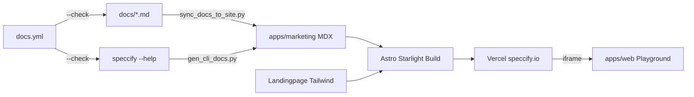

# Overview

### Goal

Umsetzung von Phase 6 gemäß `.agent/plans/phase-6-landing-and-docs.md`: Landingpage + Doku-Site unter `speccify.io` (Astro Starlight), neuer Workspace-Member `apps/marketing/`, Sync-Skripte aus Repo-`docs/` und CLI-`--help`, Playground-Iframe, neuer CI-Workflow `docs.yml`.

### Stage-0 (User-bestätigt)

- Stack: Astro Starlight (Docs) + eigener Tailwind-Look (Landing)
- Layout: ein Member `apps/marketing/` (Landing + Docs)
- Hosting: Vercel, Domain `speccify.io`
- Analytics: Plausible, prod-only, EN-only
- CLI-Reference: Autogen + CI `--check`
- Playground: Live-Iframe
- docs/-Beziehung: Repo-`docs/` bleibt Source, MDX wird daraus generiert
- Legal-Texte: Platzhalter
- i18n: EN-only (DE → Phase 8)

### In-Scope

- `apps/marketing/` (Astro Starlight + Tailwind für Landing)
- Doku-Navigation (Getting Started, Concepts, CLI, MCP, Targets, Conformance, Registry, Workspaces) + Pagefind-Suche
- `scripts/sync_docs_to_site.py` (Repo-`docs/*.md` → MDX, `--write`/`--check`)
- `scripts/gen_cli_docs.py` (`speccify --help` → MDX, `--write`/`--check`)
- Landingpage (Hero, Problem/Lösung, Demo, Targets, How-it-works, Footer)
- `/try-it` mit Playground-Iframe + Fallback
- `.github/workflows/docs.yml` (Build, Sync-Drift, Link-Check, markdownlint)

### Out-of-Scope

- Marketplace, Community-Features, i18n/DE, finale Legal-Texte, tiefere SEO, Visual-Regression-Vertiefungen (Phase 7).

# Technical Design

### Current Implementation

- `apps/web/frontend/` (Next.js 15 Playground) + `apps/web/backend/` (FastAPI) — kein Marketing-/Doku-Asset.
- `docs/` enthält `conformance.md`, `visual-regression.md`, `workspaces.md` als Markdown.
- CLI in `cli/src/speccify_cli/` (Typer/Click) mit `--help` pro Subcommand.
- Kein `speccify.io`-Deploy, kein pnpm-Member für Marketing.

### Key Decisions

 Decision | Choice | Rationale |
---|---|---|
 Doku-Stack | Astro Starlight | MDX, Pagefind, minimaler JS-Footprint |
 Layout | Ein Member `apps/marketing/` | Sauber vom Playground getrennt, ein Build |
 Hosting | Vercel + `speccify.io` | Domain vorhanden, PR-Previews |
 Landing-Design | Eigener Tailwind-Look | Marken-Identität |
 Doku-Design | Starlight-Default | Geringe Pflege |
 docs/-Source | Repo bleibt Source, MDX generiert | Offline-Lesbarkeit + CI-Drift-Check |
 CLI-Ref | Autogen + CI `--check` | Drift-Schutz |
 Playground | Live-Iframe | Immer aktuell |
 Analytics | Plausible prod-only | Privacy-friendly |

### File Structure (neu)

```
apps/marketing/
  package.json
  astro.config.mjs
  tailwind.config.mjs
  src/
    pages/{index,try-it}.astro
    content/docs/{getting-started,concepts,cli,mcp,targets,registry}/
    content/docs/{conformance,visual-regression,workspaces}.mdx
    components/  layouts/  styles/
  public/{logo.svg,og-image.png}

scripts/{gen_cli_docs.py,sync_docs_to_site.py}
.github/workflows/docs.yml
```

### Sync-Verträge

- `sync_docs_to_site.py`: liest `docs/*.md` → MDX mit Starlight-Frontmatter, normalisiert relative Links (`./x.md` → `/x/`); `--check` exit-1 bei Drift.
- `gen_cli_docs.py`: iteriert Top-Level-Commands aus `speccify --help` (oder Typer-Introspektion), rendert MDX pro Command (Usage + Options-Tabelle); `--check` exit-1 bei Drift.

### Architecture Diagram



### Risks

- Drift `docs/` ↔ Site → CI `--check`-Modi.
- Live-Iframe-Downtime → Fallback-Hinweis + Cross-Link.
- Plausible leakt in Dev → Env-Guard in `astro.config.mjs`.
- Stack-Lock-In Starlight → Standard-MDX hält Migrations-Pfad offen.

# Testing

### Validation Approach

- `pnpm --filter speccify-marketing build` grün.
- `python scripts/sync_docs_to_site.py --check` exit-0.
- `python scripts/gen_cli_docs.py --check` exit-0.
- `lychee` Link-Check über Build-Output.
- `markdownlint` über MDX/Markdown.
- Lighthouse (manuell, Stage 4): Performance ≥ 90, A11y ≥ 95 auf Landing.

### Key Scenarios

- Landingpage rendert Hero, CTA, Demo-Snippet.
- Quickstart aus Doku reicht für `speccify lint` + `pull`.
- Neuer CLI-Subcommand ohne Regen → CI rot; `--write` macht grün.
- Edit in `docs/workspaces.md` ohne Sync → CI rot; Sync macht grün.

### Edge Cases

- Playground offline → Fallback-Block + Cross-Link sichtbar.
- Plausible geblockt → Site funktioniert normal.
- Leerer Pagefind-Index → Default-Verhalten dokumentiert.

# Delivery Steps

###   Step 1: Stage 1 — Workspace-Setup apps/marketing + Starlight-Skeleton
Neuer pnpm-Workspace-Member `apps/marketing/` baut lokal eine leere Astro-Starlight-Site.

- `apps/marketing/` via `npm create astro@latest -- --template starlight` initialisieren, Struktur an Plan anpassen.
- `package.json` mit Name `speccify-marketing`; `@astrojs/tailwind`-Integration nur für Landing-Routen.
- `pnpm-workspace.yaml` (+ Root-`package.json` falls vorhanden) so anpassen, dass `apps/marketing/` Member ist.
- `astro.config.mjs` mit Starlight-Integration und Sidebar-Skeleton für Getting Started, Concepts, CLI, MCP, Targets, Conformance, Registry, Workspaces; Pagefind-Default.
- Plausible-Snippet via `PUBLIC_PLAUSIBLE_DOMAIN`, nur in Prod aktiv.
- README-Link auf `apps/marketing/` ergänzen.

###   Step 2: Stage 2 — Doku-Sync aus Repo-docs/
`scripts/sync_docs_to_site.py` spiegelt `docs/*.md` nach `apps/marketing/src/content/docs/*.mdx` und ist via `--check` im CI verifizierbar.

- Skript mit `--write` (default) und `--check`-Modus implementieren.
- Frontmatter-Generator (title aus erstem H1, description aus erstem Absatz).
- Link-Rewrite: relative `./xxx.md` → Starlight-Pfad `/xxx/`.
- Initiale MDX für `conformance`, `visual-regression`, `workspaces` erzeugen und committen.
- Stub-Seiten für `getting-started`, `concepts`, `mcp`, `targets`, `registry` handgeschrieben anlegen.
- Pytest `tests/test_sync_docs.py`: Roundtrip + `--check`-Exit-Codes.

###   Step 3: Stage 3 — CLI-Reference Autogen
`scripts/gen_cli_docs.py` regeneriert `apps/marketing/src/content/docs/cli/*.mdx` aus `speccify --help` und ist im CI per `--check` verifiziert.

- Top-Level-Commands aus `speccify --help` (oder via Typer-Introspektion in `cli/src/speccify_cli/`) ermitteln.
- Pro Command MDX mit Frontmatter (title/description), Usage-Block, Options-Tabelle rendern; deterministische Ausgabe.
- `--write` / `--check`-Modi analog Stage 2.
- Index-Seite `cli/index.mdx` mit Command-Übersicht.
- Pytest `tests/test_gen_cli_docs.py`: Snapshot pro Command.
- Initialen Lauf ausführen und MDX committen.

###   Step 4: Stage 4 — Landingpage (Tailwind-Look)
`apps/marketing/src/pages/index.astro` zeigt eine vollständige Landingpage mit Hero, Sections und Footer.

- Hero („npm für Spezifikationen statt für Code“) + Sub-Headline + Primär-CTA (Quickstart) + Sekundär-CTA (GitHub).
- Problem/Lösung-Block mit 3–5 Stichpunkten.
- Demo-Block: Code-Snippet `speccify pull spec://button@1.0.0 --target react` + statischer Output, Shiki-Highlighting.
- Targets-Block (React, SwiftUI, Angular) mit Logos.
- „How it works“ 3-Schritte (Spec → Resolver → Codegen).
- Footer: MIT, GitHub-Link, Platzhalter-Seiten für Imprint/Datenschutz.
- Tailwind-Config auf Landing-Layout begrenzen, Starlight-Routen unberührt.
- Manueller Lighthouse-Smoke: Performance ≥ 90, A11y ≥ 95.

###   Step 5: Stage 5 — Playground-Iframe + Cross-Links
`/try-it` lädt den Live-Playground per Iframe mit Fallback bei Downtime.

- `src/pages/try-it.astro` mit `<iframe>` auf `PUBLIC_PLAYGROUND_URL`.
- Fallback-Block (sichtbarer Cross-Link + Hinweis), wenn URL leer oder Iframe blockiert.
- Header-/Footer-Cross-Links sitewide: GitHub, Playground, Doku.
- `try-it` in Starlight-Sidebar + von Landing-CTA aus verlinken.

###   Step 6: Stage 6 — CI-Workflow docs.yml
Neuer GitHub-Actions-Workflow validiert Build + Sync-Drift + Links bei jedem PR.

- `.github/workflows/docs.yml` mit Pfad-Filter `apps/marketing/**`, `docs/**`, `cli/src/**`, `scripts/gen_cli_docs.py`, `scripts/sync_docs_to_site.py`.
- Jobs: `pnpm install` → `python scripts/sync_docs_to_site.py --check` → `python scripts/gen_cli_docs.py --check` → `pnpm --filter speccify-marketing build` → `lychee` Link-Check → `markdownlint`.
- `docs/deploy.md` mit Vercel-Projekt-Setup + Custom-Domain `speccify.io` + PR-Preview-Verhalten dokumentieren (Account-Schritte führt User aus).
- Default-CI (`ci.yml`) bleibt unberührt.

###   Step 7: Stage 7 — Verifikation, Doku, Archivierung
Phase 6 ist abgeschlossen und archiviert.

- Manueller Smoke: `pnpm --filter speccify-marketing build` grün; interne Links auf gebauter Site auflösen; CLI-Reference matcht aktuelle Binary; Playground-Iframe lädt.
- `.agent/agent.md` „Aktuelle Phase“ auf Phase 6 setzen, Verifikationszahlen ergänzen.
- README mit Doku-Site-Link + Quickstart-Hinweis aktualisieren.
- Plan nach `.agent/plans/archive/phase-6-landing-and-docs.md` verschieben.
- Tag-Vorschlag an User: `v0.11.0-phase-6` (nicht selbst setzen, vgl. `rules.md`).