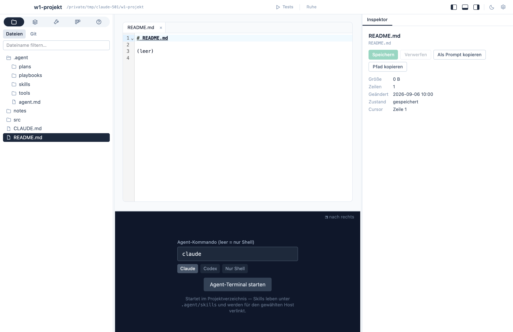
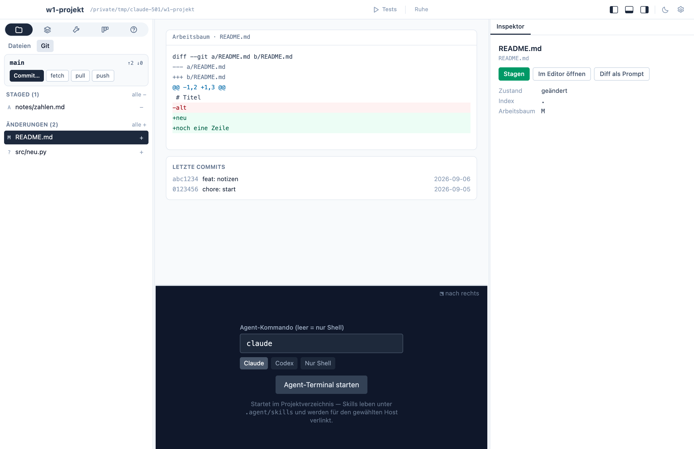

The **Files** area is what lets you leave the IDE closed for
agent-driven work: browse the project, read and edit files, see what
changed, stage, commit, pull, push. It is not a full IDE — no language
server, no refactoring — and that is deliberate: the agent in the
terminal does that part better than a rebuilt IDE would.

## Files

The navigator shows the project tree, read folder by folder as you
expand it. `.gitignore` rules apply and `.git` stays closed, so
`node_modules` and build output do not clutter the list; a name filter
sits at the top.

A click opens the file as a tab above a **code editor** (CodeMirror)
with syntax highlighting for Markdown, TypeScript, JavaScript, Python,
Rust, JSON, YAML, HTML, and CSS, search with ⌘F, and the usual editing
keys. **⌘S saves**; a dot on the tab marks unsaved changes, and every
keystroke is also kept as a draft that survives an app restart. The
inspector shows size, line count, modification time, and the cursor
line, with **Save**, **Discard**, **Copy as prompt** (path and line as
the reference, so the agent can open the exact spot), and **Copy
path**. Its **History** tab lists the commits that touched the file;
click one to see that commit's diff for exactly this file, and copy it
as a prompt. When the agent changes a file you have open but did not
touch, it reloads.

## Git

The **Git** tab runs on the `git` you already have installed — which
is why your credentials, keychain, and SSH agent just work, exactly as
in the terminal. The navigator header shows the branch, its upstream,
and how many commits you are ahead or behind, with **fetch**, **pull**,
and **push** buttons that stream their output and show up in the
activity view. Below it, the changed files in two lists, **Staged** and
**Changes**; **+** and **−** on a row stage or unstage it, *all +* /
*all −* do it for the whole list.

Click a file for its **diff** in the middle. Every hunk carries a
**Stage hunk** (or **Unstage hunk**) button, so only the lines that
belong together go into a commit — the rest stays in the working tree
for the next one. The inspector names the file's state and offers
**Stage**, **Open in editor**, **Diff as prompt**, and **Discard…**
(a second click confirms; untracked files are deleted). Its tabs:
**Changes**, and **History** — the commits that touched this file, a
click shows that commit's diff.

Click a commit in the **Recent commits** list to open it in the
inspector: the files it changed (click one to narrow the diff to it),
the full message, **Copy hash**, and **Diff as prompt**.

### Committing

The commit panel lives in the inspector (the **Commit…** button in the
branch header jumps there). Three ways:

- **Commit** — write a message, press the button or ⌘⏎; only staged
  changes go in.
- **Commit all** — stage everything first, then commit with your
  message.
- **Let the agent commit** — types a request into the agent terminal:
  read the staged diff, write a Conventional Commit message, commit,
  don't push. Confirm with Enter there, as with any prompt.

Next to the commit box, the **Branches** tab lists local branches with
their upstreams: click one to switch, or type a name and **Create** to
branch off. The last commits are listed under the diff. Without a
repository, the navigator offers `git init`; with a clean tree it says
so — what the agent changes appears here the moment it happens.

The toolbar has **Pull**, **Push**, **Commit**, and **Agent** buttons
built in, next to any action you mark for the toolbar; which of them
show, and in what order, is set per project in the settings popover
behind the gear.

What the Git tab does not do, on purpose: hunk-level staging, branch
switching, merge tooling. Conflicts are shown, not resolved — that is
a job for the terminal.
