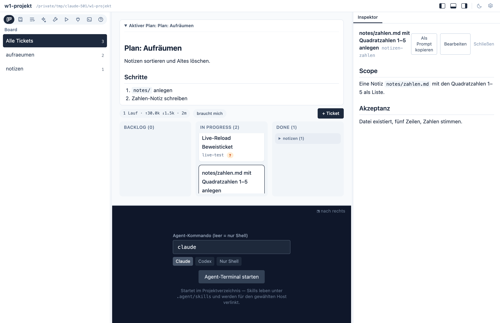

**The Speccify app** is a desktop app (macOS and Windows) for running
a project *with* a terminal agent. The agent (Claude Code, Codex, or
any other) does its work in the repository; the app renders that same
repository for you, the owner: the kanban board, the plans, the
skills and tools, the project actions. Nothing lives only in the
app — every ticket, plan, and setting is a plain file under
`.agent/`, committed with your code.

## The division of labor

- **You** decide what gets built, answer the agent's questions, and
  review the results — from the app.
- **The agent** slices plans into tickets, works them one at a time,
  and writes down what it did — from the terminal.
- **The repository** is the single shared state. The app picks up
  file changes on its own: when the agent moves a ticket, your board
  moves; when you answer a question in a ticket, the agent's next run
  sees it.

The contract between the two sides is `.agent/agent.md` — read by
every agent; files like `CLAUDE.md` and `AGENTS.md` just point to it,
so any agent product lands in the same workflow. The first time you
open a project, a workflow banner offers **Set up**: it writes the
versioned workflow block into `.agent/agent.md`, creates the
`/ticket-next` and `/ticket-ask` skills and the `.agent/board` and
`.agent/plans` folders, and links `.claude/skills` and
`.agents/skills` to `.agent/skills` (a junction on Windows) — so
both hosts see the same skills.

## Dashboard and project windows

The app starts on a **dashboard** — your projects, plus the shared
pieces: library, environment, servers, agents, settings. Each project
opens in its **own window** with the tabs **Board, Playbooks, Plans,
Skills, Tools, Actions, MCPs, Agent, Help** as an icon bar at the top
of the left **navigator**, with the tab's list below it — plans,
playbooks, skills, a plan filter on the board. The selected item fills
the middle, and an **inspector** on the right shows its detail (a
ticket with its history, for instance). The agent terminal lives in a resizable bar at the bottom,
or — your choice, per project — as a tab in that right sidebar. All three areas can be resized by dragging and hidden with
the toolbar toggles, the way Xcode does it; sizes are remembered per
project. The gear in the toolbar opens the settings — light, dark, or
system appearance for all windows. Claude Code and Codex are
equal presets for the terminal — nothing in the workflow is specific
to either.

- **[The board](/app/board/)** — tickets in `Backlog`,
  `In Progress`, `Done`; per-ticket history; badges for tickets that
  wait on you.
- **[Plans & playbooks](/app/plans/)** — the markdown plans under
  `.agent/plans/`, with exactly one `active` at a time, an escalation
  banner when the agent needs you, and **Copy as prompt**; next to
  them the playbooks under `.agent/playbooks/` — standing procedures
  such as a release, which are reused rather than worked off.
- **[Skills & tools](/app/skills-tab/)** — what the agent can
  do here, including skills expanded from
  [Speccify sources](/speccify/overview/).
- **[Actions](/app/actions/)** — project commands the app runs
  itself, with live output.

Start with [the board](/app/board/) — it is where a normal day
happens.
