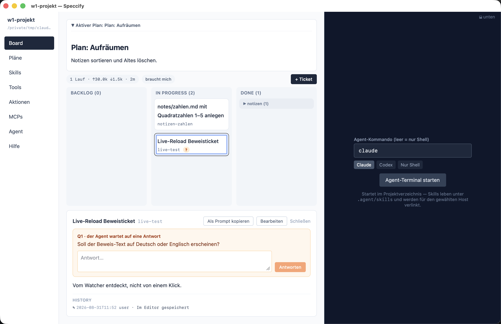

Some decisions are yours alone: scope, money, taste, anything
irreversible. The workflow's rule for the agent:

> When you need a decision only the owner can make, **ask in the
> chat, right now**. Wait for the answer; do **not** guess and
> continue. A wrong assumption costs more than a short pause.

The chat is where the question is *asked* — but chat scrolls away.
So every answered question is **recorded in the spec**, where the
decision belongs:

```markdown
## Questions

### Q1 · answered · 2026-08-06T10:00:00Z
Should the run history be persisted, or is session scope enough?

### A1 · bo · 2026-08-06T10:02:00Z
Session scope is enough.
```

Questions are numbered consecutively and numbers are never reused.
The spec is the record, not a mailbox: normally the Q/A block is
written complete, after you answered, and the outcome goes into
`## Decisions`.

## When you're not there

If a run ends without an answer — you're away, or the agent was
started unattended — the question is written as *open*:

```markdown
### Q2 · open · 2026-08-07T18:30:00Z
Which of the two paywall layouts should ship?
```

The spec's frontmatter gets `open_question: Q2`, the spec stays in
`Doing`, and the board shows it as **waiting** — the app also posts a
system notification, so a new question doesn't wait for you to look.
You answer whenever you're back — in the answer field at the very top
of the spec's inspector, by adding the `### A2 · bo · …` block
directly in `SPEC.md`, or just in the next chat; the agent's next run
records it, clears the flag, and continues. Settled questions fold
away under a collapsible **Answered (n)** section.



The effect, months later: every "why is it like this?" has a
findable, timestamped answer sitting in the spec that made the
decision — not in a chat log nobody can search.
