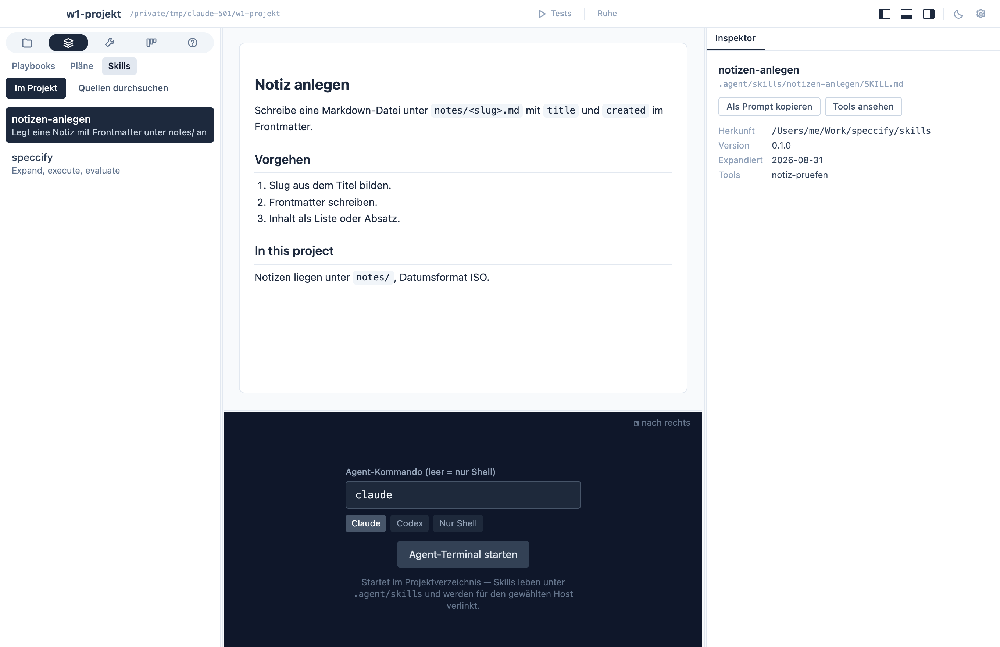

The skills tab (area *Orga*) shows what the agent knows how to do in
*this* project: the [skills](/fundamentals/skills/) under
`.agent/skills/`, listed in the navigator, rendered in the middle,
with their origin from `expansions.yaml` in the inspector. The tools
tab (area *Tech*) does the same for the [tools](/fundamentals/tools/)
under `.agent/tools/`, with each platform's verification status in the
inspector — the same files the agent reads, rendered for you.



## One source of truth, many agents

`.agent/skills/` is the source; agent-specific folders are links
into it (a junction on Windows):

```text
.claude/skills → ../.agent/skills
.agents/skills → ../.agent/skills
```

Add or edit a skill under `.agent/skills/` and every agent sees it
immediately. The rule is the same for you and the agent: edit there,
never inside a dot-folder.

## Sources: skills you didn't write

Skills and tools can come from a **Speccify source** — a skills repo
or folder. Sources live in two places: the dashboard's **Library**
holds the global ones every project sees (most people need just one),
and the skills tab's **Browse sources** mode adds sources for this
project only — a customer's GitLab, a private GitHub repo, a folder
on disk. **+ Source** takes a Git URL or a folder. Git sources are
cloned once into `~/.speccify/sources/` and pulled with **Refresh**;
access goes through the same `git` your terminal uses (credential
helper or SSH key), so private repos work without any extra setup in
Speccify. The source's folder structure *is* the organization — its
folders are the categories you browse. Pick a skill to preview it;
**Import (expand)** in the inspector types the matching
`speccify add … --source … && speccify expand …` command into the
agent terminal. `--source` remembers the source under `sources:` in
`speccify.yaml`, so later `verify` and `expand` runs find the skill
on their own, and the [expand step](/speccify/expand/) does the rest:
normal skills land in `.agent/skills/`, tool contracts in
`.agent/tools/`, and `.agent/speccify/expansions.yaml` records where
each came from, at which version, and whether each tool's
implementation is `verified` on this platform.

Two rules keep the bookkeeping sane:

- **Edit the skills and tools, not `expansions.yaml`** — the record
  is maintained by Speccify; hand-edits would make it lie.
- **Tools are pre-approved deliberately.** The host's settings
  (for Claude Code, `.claude/settings.json`) allowlist running
  what's under `.agent/tools/` — implementations are
  contract-checked, so the agent can call them without a permission
  prompt each time.

When the agent uses an expanded skill while working a ticket, it logs
an `agent_run` line in the ticket's history naming the skill and
tool — the [ticket detail](/app/board/) is the trail of what was
used; there is no separate log file.
