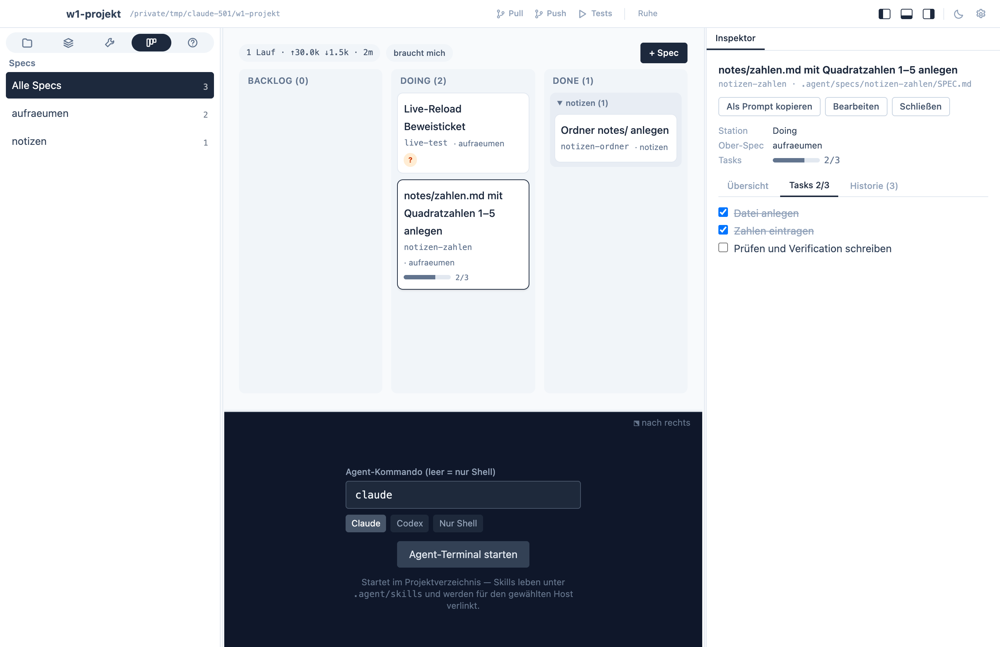

A **spec** is one piece of work you want to accept in a single review:
a feature, a refactor, an investigation. It lives in its own folder,
`.agent/specs/<slug>/SPEC.md`, and moves through three stations — and
only three:

```text
Backlog  →  Doing  →  Done
```

There are no tickets. The steps inside a spec are **checkboxes under
`## Tasks`**; the agent ticks them as it goes, the board shows `3/7`.
A spec that is too big for one review gets child specs (`parent:`); one
that is too small becomes a task in an existing spec.

## A spec is a file

```markdown
---
station: Backlog
order: 10
created: 2026-09-09
needs_human: false
ready: false
open_question: null
parent: null
---
# Import skills from any git repository

## Why
One to three sentences: the occasion, the benefit, who needs it.

## What
What is in scope — and what explicitly is not.

## Acceptance
- When a git URL is added as a source, then the app clones it once and
  shows its skills in the browser.
- When access is missing, then the app shows git's message and how to
  sign in.

## Decisions
- D1 (2026-09-09, BO): managed checkouts, no tags needed.

## Tasks
- [x] Source model in Rust
- [ ] Library in the dashboard
- [ ] Docs

## Verification
What was run and what was seen.

## Questions
```

The first heading is the title, the folder name is the id. Three
optional flags matter to you as the owner:

- `needs_human: true` — a human must accept this spec (a manual test,
  an account, a DNS entry). The agent finishes its part, sets
  `ready: true` and leaves the spec in Doing for you.
- `open_question: Q1` — the agent is blocked on a question you haven't
  answered yet. See [Questions](/app/questions/).
- No `order` — the spec is an idea; it sorts last in Backlog.

## The gate, and what "done" means

**Backlog → Doing is your approval.** The agent starts a spec only
when you moved it there (or told it to). Before building it attacks
the spec — missing or untestable acceptance, contradictions, hidden
dependencies — fixes what it can in the spec itself and asks the rest.
Then it works through the tasks, records decisions and what it
verified, and appends an `agent_run` line to the history.

**Done means:** every task ticked, `## Verification` written, the
history line appended. With `needs_human` the agent sets `ready`
instead and you move the spec to Done. **Archive** moves a finished
spec to `.agent/specs/archive/<date>-<slug>/`, history included.

## The board in the app



Click a card to open the spec in the inspector on the right: an
*Overview* tab with questions and text, a *Tasks* tab where you can
tick boxes yourself, a *History* tab with the timeline. Double-click a
card, or **Edit** in the inspector, for the editor sheet; drag & drop
moves specs between columns; **+ Spec** creates one from the template.
The navigator filters by parent spec, the **needs me** filter shows
only specs waiting on you, and Done is grouped by parent so finished
work stays legible.

## History: the spec's memory

Each spec folder has an append-only `history.jsonl` — one JSON line per
meaningful step:

```json
{"actor":"agent:claude","event_type":"agent_run","summary":"Tasks 3–5; skills: speccify","spec_id":"git-sources","timestamp":"2026-09-09T09:05:30Z","tokens_in":9000,"tokens_out":2200}
```

The app logs what the app changes; **the agent logs its own steps**.
The event types (`spec_created`, `station_changed`, `spec_edited`,
`agent_run`) each get an icon in the history tab, and the board's KPI
row is computed from the `agent_run` events — runs and effective
input — so the cost of the work stays visible next to the work.

## Playbooks: procedures, not work

A **playbook** describes a procedure — release, deploy, onboarding a
machine. It never finishes; you run it whenever the occasion comes
around. `.agent/playbooks/<name>.md`, plain markdown, committed with
the code, with a `description` in the front matter and **Copy as
prompt** to hand it to the agent. The *Playbooks* tab lists them,
**+ Playbook** creates one, and the editor saves as you type.

## Specs, playbooks, skills — which is which?

- A **spec** is work: it has a station, tasks, and an end.
- A **playbook** is a procedure you run again and again.
- A **skill** is know-how the agent applies on its own when the
  situation matches — see [Skills, tools & sources](/app/skills-tab/).
