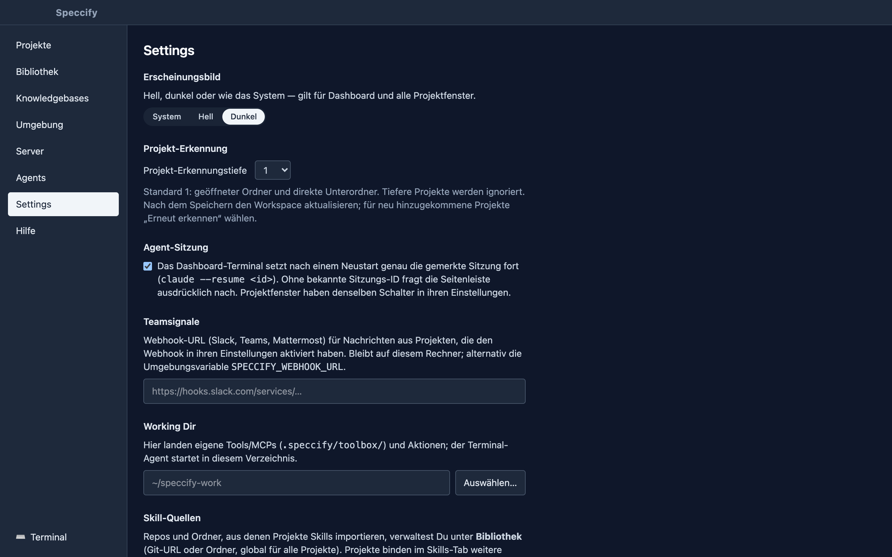

Products rarely live in one repository: an app, a sync service, a
website, each with its own Git history and its own `.agent/` folder. A
**workspace** is Speccify's answer — several repositories side by side,
without merging them and without a second copy of anything.


## Shared register bindings

Use **Registerquellen…** on the board to give registers stable, shared IDs and
bind them to local checkouts. Export `workspace-registers.json` into an existing
register to share the same board definition with teammates and the Web-Board.
Local paths and credentials stay outside that manifest. When comparing multiple
checkouts of one register, choose the write target explicitly; differing snapshots
produce a warning.

**Neue Spec in** chooses where a cross-repository spec is stored. The editor's
**Betroffene Code-Repos** field accepts comma-separated references such as
`api@spec/048-login, web@spec/048-login`. Each spec still has one canonical file.
Root knowledge is included alongside child registers, even without Git at the root.
Stale desktop and browser edits are rejected using the displayed spec revision.

## Folder discovery

The dashboard's **Projects** tab has one entry: choose a folder and open
it. The app looks at the folder before anything is stored:

- **A Git repository** — the folder has its own `.git` — opens as a
  single project in its own window, exactly as before. Nested
  repositories or example projects inside it (submodules, fixtures) do
  not turn it into a workspace; choose the parent folder if you want
  that.
- **A folder of repositories** — no `.git` of its own, but at least one
  repository or Speccify project below it — is saved as a workspace and
  opens the shared workspace window described here.
- **Anything else** — a plain folder — opens as a simple project.

Discovery is bounded and read-only: **one level below the opened folder by default**, no symlinks, no
dependency or build folders, no Git commands, no files written into
your repositories. It recognizes `.git` folders, `.git` pointer files
and linked worktrees, and Speccify markers such as `speccify.yaml` or
`.agent/agent.md`. Budget limits and read errors are reported separately.

Recently opened projects stay listed under the entry. An invalid path
opens nothing and stores nothing.

## Choose the discovery depth

In the dashboard, open **Settings → Projekt-Erkennungstiefe** (project
discovery depth), choose **1–16** and save. This setting applies to all workspaces.
The opened folder is depth 0; its direct children are depth 1.

```text
Projects/                          depth 0 · opened folder
├── app/                           depth 1 · discovered by default
│   └── external/
│       └── reference/              depth 3 · requires depth 3
└── website/                       depth 1 · discovered by default
```



After saving, click **Aktualisieren** in an open workspace. To find additional
repositories, use **Erneut erkennen** in the dashboard's saved workspace section.
Repositories beyond the selected depth are ignored without a depth warning.
Previously discovered entries are hidden from the navigator, shared board and
the next terminal's context. Their names, IDs and groups remain saved and return
when you increase the depth. Open editor drafts and running actions keep their
original targets while hidden; no repository files are deleted.

An opened folder with its own Speccify guidance can still appear as a root
project alongside its child repositories. Separate clones with the same name are
separate repositories; linked Git worktrees share one repository identity.

## Saved workspaces

### Ordinary folders and root files

In the workspace's **Files** view, **Workspace-Ordner** opens the parent folder's
file tree. This includes ordinary directories such as `Resources/` and files
beside your repositories. If the root is already a recognized project, its
existing entry serves this purpose. No extra Git repository is created.

You can browse deeper folders while keeping project discovery at its default
depth of 1. Git controls belong to actual repositories. If a file is open through
both the root and a child project, saving checks for intervening changes and
keeps a stale editor's draft instead of overwriting the other saved version.

### Groups and the dashboard

Every workspace you open stays in the dashboard under **Saved
workspaces**, with a **rescan** button that picks up new repositories
without touching the groups you made. Each repository starts as its
own project. Select two or more, give them a name and they become one
**project group** — OrbitNotes with its app and sync repositories, say,
next to the website in a group of its own. Rename a group, or take a
repository back out; every change is local metadata in
`~/.speccify/workspaces.json`, never a change to the repositories, and
never a merged `.agent` folder.

**All specs** shows a read-only board across every repository of the
workspace: filter by project, search by title, number or path, open the
preview and jump to the spec's own project window.

## The workspace window

**Open workspace** opens one window for the whole folder — the same
layout as a project window, with the navigator grouped by project,
repository and worktree:

- **Shared board.** The specs of all repositories on one board, each
  card naming its project and repository. Select a card and the
  inspector shows that spec exactly as its project window would: tick
  tasks, read questions and history, edit the file. Creating a spec
  names the repository it will land in. There is no drag-and-drop
  between repositories; a spec belongs to the repository it lives in.
- **Files, Git, playbooks, skills, tools, actions, MCPs** — per
  repository. Switching between repositories keeps editor drafts,
  commit messages and running action output where they were.
- **One agent in the parent folder.** The workspace terminal starts
  your agent command in the folder above the repositories — on your
  click, never automatically — and hands it a structure summary of
  the workspace: which repositories exist, where their guidance files
  are, what the groups are. You can preview and copy that context
  before starting. Each repository's actions and Git operations still
  run in that repository.

Open workspace windows come back after a restart, like project windows.

## Team registers in a workspace

The workspace board shows each repository's **team register** above the specs,
with its repository name and full worktree path. Existing specs tracked in a
repository with an `origin` remote can be moved into a shared `specs` branch:
choose **Register einrichten…**, review the affected repository and the Git
changes, then confirm with **Jetzt einrichten**. This commits and pushes the
migration for that repository. Opening a workspace does not start a migration.

For a fresh clone with an existing register, **Einhängen** mounts it at
`.agent/specs`. Mounted registers show pending changes, sync errors and conflict
decisions in the same area. **Sync** applies to the named repository. Use
**Aktualisieren** after changes made outside the app to check the status again.

A parent folder such as `AVC/` does not need its own Git repository: its child
repositories each carry their own register. A folder with no tracked specs has
no migration offer. Unavailable worktrees and projects outside the discovery
depth offer no register actions. Workspace names and groups remain local even
when the contained registers are shared with your team.

## What a workspace is not

- Not a shared team register: the grouping lives on your machine.
  Sharing workspace membership through the repositories is a separate,
  planned step.
- Not a merged repository: no common Git index, no combined `.agent`
  tree, no cross-repository refactoring tools.
- Not a fleet of agents: one workspace terminal, started explicitly.
  Project windows keep their own sessions.
