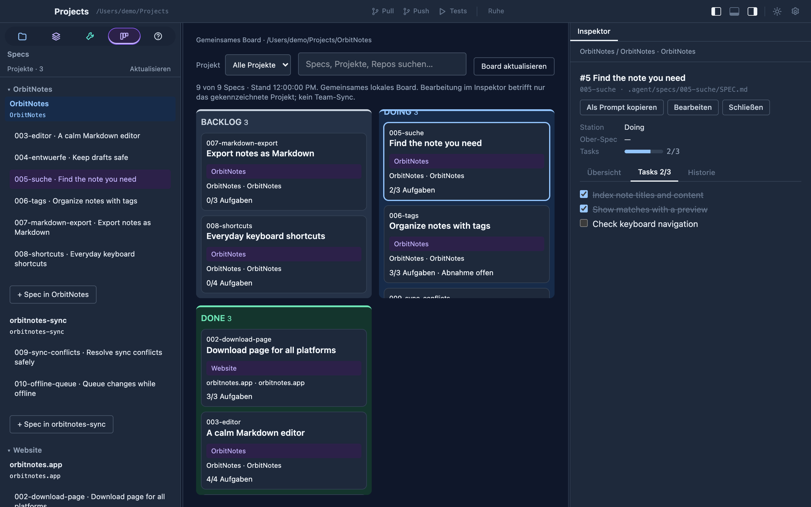

Products rarely live in one repository: an app, a sync service, a
website, each with its own Git history and its own `.agent/` folder. A
**workspace** is Speccify's answer — several repositories side by side,
without merging them and without a second copy of anything.

## Opening a folder

The dashboard's **Projects** tab has one entry: choose a folder and open
it. The app looks at the folder before anything is stored:

- **A Git repository** — the folder has its own `.git` — opens as a
  single project in its own window, exactly as before. Nested
  repositories or example projects inside it (submodules, fixtures) do
  not turn it into a workspace; choose the parent folder if you want
  that.
- **A folder of repositories** — no `.git` of its own, but at least one
  repository or Speccify project below it — is saved as a workspace and
  opens the shared workspace window described here.
- **Anything else** — a plain folder — opens as a simple project.

Discovery is bounded and read-only: 16 levels deep, no symlinks, no
dependency or build folders, no Git commands, no files written into
your repositories. It recognizes `.git` folders, `.git` pointer files
and linked worktrees, and Speccify markers such as `speccify.yaml` or
`.agent/agent.md`. If a limit stops the scan, the workspace says which
folders it skipped; open those separately if you need them.

Recently opened projects stay listed under the entry. An invalid path
opens nothing and stores nothing.

## Saved workspaces

Every workspace you open stays in the dashboard under **Saved
workspaces**, with a **rescan** button that picks up new repositories
without touching the groups you made. Each repository starts as its
own project. Select two or more, give them a name and they become one
**project group** — OrbitNotes with its app and sync repositories, say,
next to the website in a group of its own. Rename a group, or take a
repository back out; every change is local metadata in
`~/.speccify/workspaces.json`, never a change to the repositories, and
never a merged `.agent` folder.

**All specs** shows a read-only board across every repository of the
workspace: filter by project, search by title, number or path, open the
preview and jump to the spec's own project window.

## The workspace window

**Open workspace** opens one window for the whole folder — the same
layout as a project window, with the navigator grouped by project,
repository and worktree:

- **Shared board.** The specs of all repositories on one board, each
  card naming its project and repository. Select a card and the
  inspector shows that spec exactly as its project window would: tick
  tasks, read questions and history, edit the file. Creating a spec
  names the repository it will land in. There is no drag-and-drop
  between repositories; a spec belongs to the repository it lives in.
- **Files, Git, playbooks, skills, tools, actions, MCPs** — per
  repository. Switching between repositories keeps editor drafts,
  commit messages and running action output where they were.
- **One agent in the parent folder.** The workspace terminal starts
  your agent command in the folder above the repositories — on your
  click, never automatically — and hands it a structure summary of
  the workspace: which repositories exist, where their guidance files
  are, what the groups are. You can preview and copy that context
  before starting. Each repository's actions and Git operations still
  run in that repository.

Open workspace windows come back after a restart, like project windows.

## What a workspace is not

- Not a shared team register: the grouping lives on your machine.
  Sharing workspace membership through the repositories is a separate,
  planned step.
- Not a merged repository: no common Git index, no combined `.agent`
  tree, no cross-repository refactoring tools.
- Not a fleet of agents: one workspace terminal, started explicitly.
  Project windows keep their own sessions.
