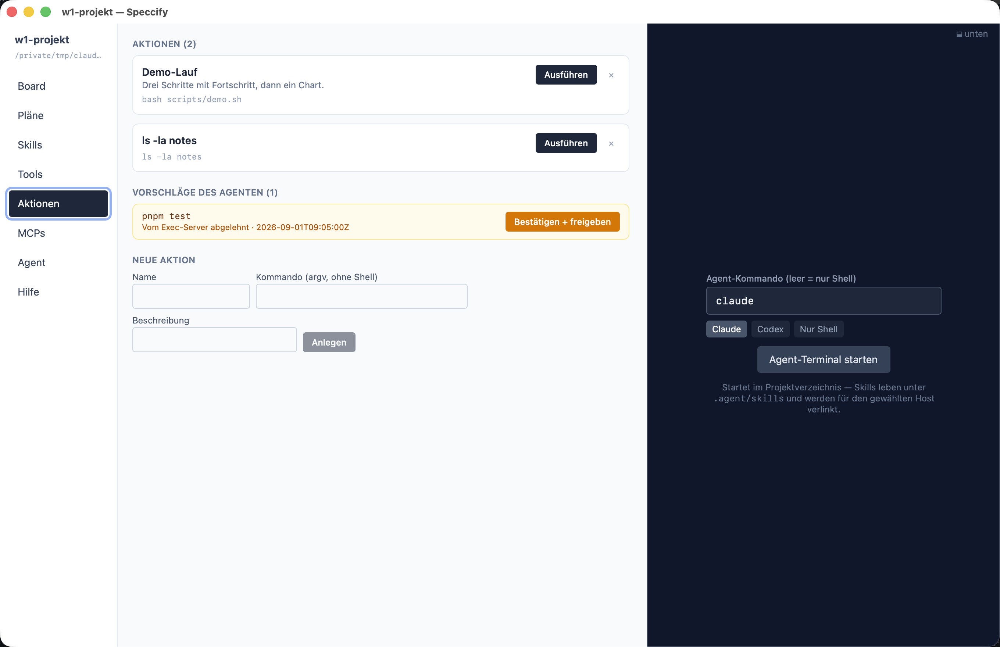

Bauen, testen, starten — die wiederkehrenden Kommandos eines
Projekts sind **Aktionen**, definiert in `.agent/actions.json` und
sichtbar im Aktionen-Tab des Projektfensters.

Eine Aktion läuft als **argv ohne Shell** — `&&`, Pipes und `$(…)`
funktionieren dort nicht. Zusammengesetzte Kommandos gehören in ein
Skript:

```json
{
  "name": "Build app",
  "command": "sh scripts/app-build.sh"
}
```

Aktionen können vor dem Lauf auch **Eingaben** abfragen — Text, Zahl,
Datei, Ordner, Auswahl, Farbe — eingesetzt in `{name}`-Platzhalter im
Kommando.

## Die App führt selbst aus

Die App startet den Prozess direkt: Das Arbeitsverzeichnis ist fest
der Projekt-Root, und jeder Lauf hat ein Timeout. Die Ausgabe streamt
live, mit Stop-Knopf und Fortschritt aus `[n/m]`-Markern wie
`[3/20]`. Eine Erweiterung: Eine JSON-Zeile wie `{"kind":"chart", …}`
in der Ausgabe wird live als echtes Diagramm gerendert; ein
Profiling-Skript kann sein Ergebnis *zeigen* statt Spalten zu
drucken.

(Einen lokalen Exec-[MCP-Server](/de/fundamentals/mcps/) gibt es
weiterhin, aber nur für gesandboxte Drittclients, die selbst keine
Prozesse starten dürfen — die App geht nicht über ihn.)

## Von abgelehnten Agent-Kommandos zu Aktionen

Das Sicherheitsmodell für die Kommandos des *Agenten* sitzt in
`.agent/exec-allowlist.json`: Kommandos, die ein erlaubtes Muster
deckt, laufen; alles andere wird in `.agent/exec-pending.json`
geparkt und erscheint im Aktionen-Tab als **Vorschlag**.
**Bestätigen** macht daraus eine Aktion *und* einen permanenten
Allowlist-Eintrag — ein abgelehntes Kommando, das du einmal
genehmigst, wird zum Knopf, den du drücken kannst.



Eine Regel spannt sich über all diese Dateien: **keine Secrets im
Repository.** Tokens leben im Schlüsselbund oder kommen als
Umgebungsreferenz wie `${MY_TOKEN}` — wenn eine Konfiguration
scheinbar ein Klartext-Secret braucht, ist das eine
[Frage an den Owner](/de/app/questions/), kein Commit.
