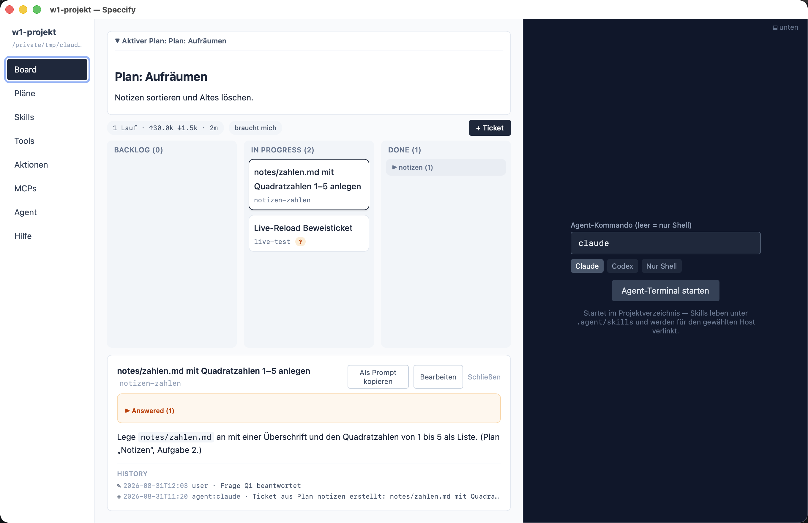

Das Board ist ein Ordner: `.agent/board/`, eine Markdown-Datei pro
Ticket. Die App rendert ihn als drei Spalten — und nur drei:

```text
Backlog  →  In Progress  →  Done
```

Zwei Invarianten halten es ehrlich: **Nur ein Ticket ist in
`In Progress`** zu jeder Zeit (der Agent beendet oder teilt, bevor er
das nächste anfängt), und **Stationen werden nie erfunden** — ein
Ticket ist in einer dieser drei, oder die App zeigt einen
Fehlerbanner.


## Ein Ticket ist eine Datei

```markdown
---
id: site-scaffold
title: Scaffold the site
station: Backlog
created: 2026-08-26T08:25:00Z
order: 1
plan: agent-fundamentals-website
---
## Scope
Was dieses Ticket umfasst — klein genug für einen Agenten-Lauf.

## Acceptance criteria
Woran beide Seiten erkennen, dass es fertig ist.
```

Drei optionale Flags betreffen dich als Owner:

- `ready: true` — der Agenten-Anteil ist fertig, das Ticket wartet in
  In Progress auf den Menschen: draufsehen, dann nach Done schieben
  (oder das Flag mit Feedback im Body zurücknehmen).
- `needs_human: true` — ein Mensch muss handeln (ein manueller Test,
  ein Konto, ein DNS-Eintrag). Die App hebt diese hervor, damit sie
  nicht unbemerkt im Backlog liegen.
- `open_question: Q1` — der Agent hängt an einer Frage, die du noch
  nicht beantwortet hast. Siehe
  [Fragen](/de/app/questions/).

## Woher Tickets kommen

Ein frisches Projekt hat einen Plan und ein leeres Board. Der Agent
liest den **aktiven Plan** (`lifecycle: active` — nur ein Plan darf
aktiv sein), schneidet ihn in kleine Tickets, geordnet nach `order`,
und arbeitet dann das Board: oberstes `Backlog`-Ticket nehmen, auf
`In Progress` setzen, die Arbeit machen, committen, auf `Done`
setzen. Ein Ticket, das sich als zu groß erweist, wird **geteilt**
statt halbfertig liegengelassen.

In der App liegt der aktive Plan aufklappbar **über dem Board** — du
siehst immer, woraus die Tickets geschnitten sind. Auf dem Board
selbst: Klick auf eine Karte öffnet das **Ticket-Detail** unter dem
Board (Body plus History), **Bearbeiten** öffnet das Editor-Sheet,
Drag & Drop verschiebt Tickets zwischen Spalten, **+ Ticket** legt
eines an, und der Filter **braucht mich** zeigt nur Tickets, die auf
dich warten. Die Done-Spalte ist nach `plan` gruppiert, damit fertige
Arbeit über Pläne hinweg lesbar bleibt.

## History: das Gedächtnis des Tickets

Jedes Ticket hat ein append-only-Log,
`.agent/board/history/<id>/index.jsonl` — eine JSON-Zeile pro
bedeutsamem Schritt:

```json
{"actor":"agent","event_type":"station_changed","summary":"Backlog -> In Progress","ticket_id":"site-scaffold","timestamp":"2026-08-26T09:05:30Z"}
```

Die App loggt, was die App ändert; **der Agent loggt seine eigenen
Schritte** — Tickets anlegen und verschieben, beantwortete Fragen
festhalten, einen Skill ausführen. Die Event-Typen
(`ticket_created`, `station_changed`, `ticket_edited`, `agent_run`)
bekommen je ein Icon im Ticket-Detail — so lässt sich das Leben
jedes Tickets rekonstruieren, ohne ein Terminal-Transkript zu lesen.
Die KPI-Zeile des Boards rechnet sich aus den `agent_run`-Events —
Läufe und effektiver Input — so bleiben die Kosten der Arbeit neben
der Arbeit sichtbar.


