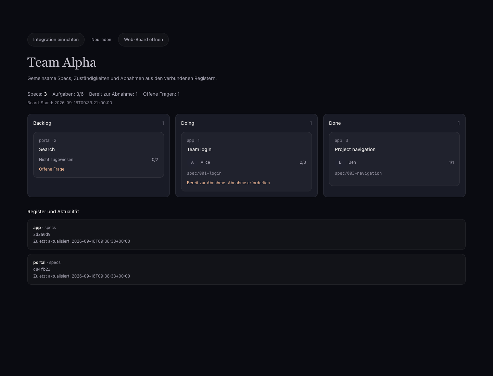

<!-- AUTOGENERIERT aus docs/ via scripts/sync_docs_to_site.py — nicht von Hand editieren. -->

Spec 032. Ein Team betreibt pro Projekt, Projektordner oder Projektgruppe ein
Web-Board, das die Spec-Register mehrerer Repositories liest, anzeigt, von
selbst aktuell hält und kleine Änderungen (Station, Tasks) zurückschreibt.
Grundlage ist das gemeinsame Register aus `docs/specs-register.md`: der Branch
`specs` jedes Repos ist die geteilte Wahrheit; das Board ist ein Leser und
ein vorsichtiger Schreiber davon, kein zweiter Speicher.

## In itsdcloud einrichten

Der Board-Dienst muss vom itsdcloud-Backend erreichbar sein. `localhost` meint
bei einem Container dessen eigenen Netzwerkraum. Den MCP-Token als
`BOARD_MCP_TOKEN` in der Board-Umgebung setzen; HTTP Basic für die Web-Seite
(`BOARD_PASSWORD`) ist davon getrennt. Außerhalb eines internen Testnetzes HTTPS
verwenden. Tokens gehören in das Verbindungsformular, nicht in URL oder Git.

### Bestehende itsdcloud-Version: MCP-Server

1. Projekt → Integrationen → **MCP-Server** → Server hinzufügen.
2. Namen, URL `https://<board>/mcp` und den Board-MCP-Token eintragen.
3. Unter **Werkzeuge wählen** nur `board_summary`, `list_repos`, `list_specs`,
   `get_spec`, `who_works_on_what` auswählen. `move_station`, `toggle_task` und
   `refresh` abwählen.
4. Im Projekt-Chat fragen: „Wer arbeitet gerade woran und auf welchem Branch?“,
   „Welche Specs sind bereit zur Abnahme?“ oder „Zeige die Aufgaben von Spec 001
   im Repo app.“ Repo-Namen gehören bei gleichen Spec-Nummern zur Identität.

### Board-Prototyp: itsdcloud Spec 0051

Der Feature-Branch `feat/0051-speccify-board` bietet **Speccify Board** direkt im
Katalog. URL und Token genügen; die fünf lesenden Tools sind vorausgewählt.
Die Projekt-Navigation öffnet die Boardansicht. Ein Klick auf eine Karte liest
die Spec, **Neu laden** holt einen aktuellen Stand. Pro Register werden Commit,
Aktualisierung und Fehler gezeigt. Ein fehlerhaftes Register bleibt als veraltet
sichtbar; ein Verbindungsfehler wird nicht als leeres Board dargestellt.

Ansicht und Chat benutzen dieselbe Integration und Tool-Auswahl. Wird etwa
`get_spec` abgewählt, sind auch die Detailaufrufe gesperrt. Mitglieder lesen,
Eigentümer verwalten die Verbindung. Die Ansicht schreibt keine Specs.



Stand 2026-09-16: Prototyp mit echtem HTTP-MCP-Dienst und zwei synthetischen
Git-Registern geprüft (drei Specs, Counts und Commits stimmen mit dem Web-Board
überein). Deutsch/Englisch und Hell/Dunkel geprüft. Chat-Toolaufrufe sind mit einem
deterministischen Testmodell geprüft; natürliche Modellantwort und produktive
Einrichtung sind noch abzunehmen. Der Feature-Branch ist noch nicht auf master.

## Starten

```bash
# aus dem Speccify-Checkout
uv run speccify-board --config board.yaml --data ./board-data --port 8790

# als Container (Beispiel-Compose liegt in apps/board/)
cd apps/board && cp board.example.yaml board.yaml && docker compose up -d
```

Umgebungsvariablen: `BOARD_CONFIG`, `BOARD_DATA`, `BOARD_HOST`, `BOARD_PORT`,
`BOARD_PASSWORD` (HTTP Basic, Nutzername beliebig), `GIT_TOKEN` (für
`${GIT_TOKEN}` in URLs). SSH-URLs brauchen einen gemounteten Schlüssel unter
`/home/board/.ssh` im Container.

## Konfiguration

```yaml
title: Team Alpha
refresh_seconds: 60                 # Untergrenze 5
author: Speccify Board <board@example.com>   # Autor der Board-Commits
repos:
  - name: app                       # Buchstaben, Ziffern, . _ -
    url: https://github.com/org/app.git      # flacher Klon des Branch specs
  - name: portal
    url: git@github.com:org/portal.git
    branch: specs                   # Standard
  - name: lokal
    path: /projects/projekt         # Ordner mit .agent/specs …
  - name: alle
    path: /projects                 # … oder ein Ordner voller solcher Projekte
```

`url`-Einträge werden mit `--depth=1` auf ihrem Register-Branch geklont und
im Takt von `refresh_seconds` per `fetch` und `reset --hard` aufgefrischt.
`path`-Einträge werden direkt gelesen; ein Ordner mit mehreren Projekten
bindet jedes Unterverzeichnis mit `.agent/specs` als `name/unterordner` an.
Tokens und Schlüssel gehören in die Umgebung, nie in die Datei.

## Oberfläche und API

### Gemeinsame Bindung mit dem Desktop (Spec 046)

Ein im Desktop exportiertes `workspace-registers.json` enthält dieselben
Register- und Code-Repo-IDs für alle Rechner. Der Server ordnet jede Register-ID
genau einem Checkout oder Remote zu; die Pfade sind nur lokale Konfiguration:

```yaml
manifest: ./workspace-registers.json
bindings:
  team-register:
    url: git@github.com:org/team.git
    branch: specs
```

Alternativ `path: /srv/checkouts/team` für ein Projekt mit `.agent/specs` oder
den Registerordner selbst. `manifest`/`bindings` ersetzen die bisherige `repos`-Liste.
Alle Manifestquellen müssen gebunden sein. Zwei Register mit gleicher Spec-ID
bleiben getrennt; es wird nicht nach Namen oder Nummer zusammengelegt.
Das bisherige `repos`-Format bleibt nutzbar. Ein lokaler Workspace liest nun Root
**und** unmittelbare Unterprojekt-Register, auch bei leerem Root-Register.

Antworten enthalten pro Spec `revision` (SHA-256) und `repositories`, etwa
`api@spec/048-login, web@spec/048-login`. Browseraktionen senden die Revision
als `expected_revision`; Änderungen seit der Anzeige führen zu HTTP 409.
MCP-Schreibtools akzeptieren dasselbe optionale Feld, und `get_spec` verlangt die
exakte Quelle wie `team/api`. Ältere Clients ohne Revision bleiben kompatibel,
haben aber keinen Schutz vor veralteten Eingaben. Neue Integrationen müssen die
Revision aus `get_spec`/`board.json` mitsenden.

Ungesicherte Dateien stoppen den Remote-Refresh vor einem Reset. Ungepushte
Commits bleiben erhalten und werden beim nächsten Sync erneut gesendet. Fehler
eines Registers verdecken die anderen Quellen nicht. Es gibt keinen Force-Push.
Die Prüfung erkennt geänderte Momentaufnahmen; sie ist keine verteilte Dateisperre.
Der bestehende gemeinsame Board-Zugang und MCP-Token sind weiterhin gültig;
sie prüfen keine persönlichen Git-Rechte pro angemeldetem Teammitglied.

| Weg | Inhalt |
|---|---|
| `GET /` | alle Repos: Kennzahlen (auch je Repo), Aktivität 30 Tage, Doing nach Person, Board mit Repo-Kennung und Repo-Filter |
| `GET /r/<name>/` | ein Repo |
| `GET /api/board.json` | Zusammenfassung, Repos mit Commit/Fehler, Specs als JSON |
| `POST /api/refresh` | sofort auffrischen |
| `GET /healthz` | `ok` und Zustand je Repo (ohne Passwort) |
| `POST /api/r/<name>/specs/<id>/station` `{ "station": "Doing" }` | Station wechseln |
| `POST /api/r/<name>/specs/<id>/tasks/<n>` `{ "done": true }` | Task abhaken |

Jede Karte trägt dafür ein Stations-Feld und die Task-Liste. Der Dienst ändert
nur die `station:`-Zeile bzw. die eine Checkbox (byte-stabil, wie die App),
hängt eine History-Zeile mit Akteur `board` an, committet als konfigurierter
Autor (`spec(<id>): … (Web-Board)`) und pusht in den Register-Branch. Wird der
Push abgelehnt, weil das Register weitergelaufen ist, holt er nach, rebased
und pusht erneut; bei einem echten Konflikt meldet er das und lässt die
Entscheidung der App. Lokale `path`-Einträge werden direkt geschrieben.

## MCP-Server (Spec 033): das Board für itsdcloud und andere Agenten

Jedes Web-Board ist zugleich ein MCP-Server: Streamable HTTP unter
`http://<board>:8790/mcp`, JSON-Antworten, zustandslos, geschützt durch
`Authorization: Bearer <BOARD_MCP_TOKEN>` (Umgebungsvariable; ohne sie offen,
das Seiten-Passwort gilt hier nicht). Tools, alle mit `{ok, …}`-Antwort und
Fehlercode statt Ausnahme:

| Tool | Eingabe | Ausgabe |
|---|---|---|
| `board_summary` | – | Kennzahlen gesamt und je Repo, Stand je Repo |
| `list_repos` | – | Name, Art, Branch, Commit, Aktualität, Fehler |
| `list_specs` | `repo?`, `station?`, `owner?`, `query?` | Specs mit Nummer, Titel, Station, Besitzer, Branch, Tasks, Flags, letzter Aktivität |
| `get_spec` | `repo`, `spec_id`, `history_limit?` | Felder, Tasks mit Index, History, Markdown |
| `who_works_on_what` | – | Doing-Specs je Person mit Branch und Fortschritt |
| `move_station` | `repo`, `spec_id`, `station` | Commit |
| `toggle_task` | `repo`, `spec_id`, `index`, `done` | Commit |
| `refresh` | – | Stand je Repo |

Ressourcen: `board://summary` (JSON) und `board://<repo>/<spec_id>` (Markdown).

Einrichtung, lesende Tool-Auswahl und Beispielfragen stehen oben unter
„In itsdcloud einrichten“. Der Katalogeintrag und die Board-Ansicht liegen
als Prototyp auf dem dort genannten Feature-Branch. Das spätere Gedächtnis
im Terminal beschreibt `.agent/playbooks/itsdcloud-integration.md`.

Nicht enthalten: Login je Person (ein gemeinsames Passwort), Bearbeiten von
Spec-Text, Anlegen von Specs, Echtzeit-Push in den Browser (die Seite lädt
nach Aktionen neu). Ein nicht erreichbares Repo wird oben auf der Seite und
in `/healthz` gemeldet; die anderen Repos laufen weiter.
